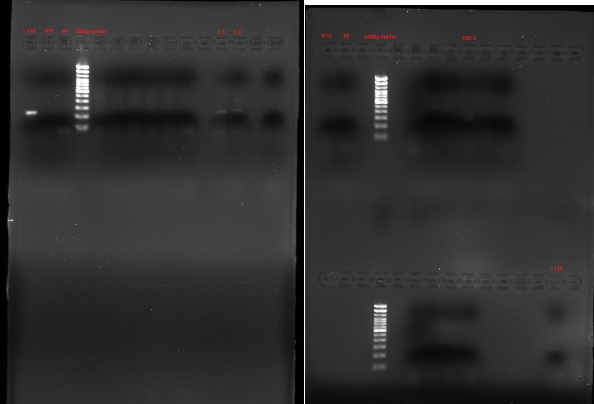
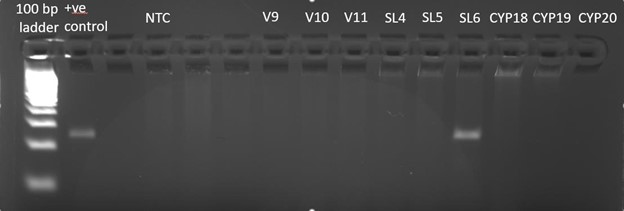
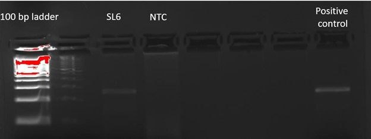

Publication in preparation.

A comprehensive mosquito-borne virus surveillance project in Western Manitoba.

Authors: **Baril, C. W.**, Duncan, C., Sparrow, Chrest, B., J., Pilling, B., Mikkelsen, M., LaZerte, S., Cassone, B.J.

<!--more-->

## 1 Introduction

Mosquitoes transmit many arboviruses and parasites that cause significant human and veterinary morbidity and mortality around the globe (Ansari and Shope, 1994; Driggers et al., 2016; Evans and Peterson, 2019; Gan and Leo, 2014; Meier-Stephenson et al., 2006; Reimann et al., 2008; Weaver and Vasilakis, 2009). Of the global communicable disease burden, 17% of diseases are estimated to be caused by mosquito-borne pathogens and cause over 700,000 human deaths annually (W.H.O., 2020). Mosquitoes are distributed around the globe including in Arctic regions (Tolle, 2009; White et al., 2004). In Canada, the main MBD is West Nile virus (WNV). WNV infections can present as asymptomatic, cause mild flu-like symptoms and in severe cases neurological disease (PHAC, 2022). Since surveillance began in 2002 after the import of WNV to North America in 2001, 6,623 WNV human cases have been reported to the Public Health Agency of Canada as of 2021 (PHAC, 2022).

WNV is the main mosquito borne pathogen known to be present in Manitoba. WNV is vectored primarily by Culex mosquitoes while also having been found harboured by *Aedes*/*Ochlerotatus* mosquitoes. The presence of WNV within the Culex mosquito population and the presence of *Culex* mosquitoes themselves are monitored by Manitoba Health (Todoric et al., 2022). No monitoring is carried out on *Aedes*/*Ochlerotatus* mosquitoes in Manitoba and the focus is on *Culex* mosquitoes because they are the main vector for WNV in Manitoba (Todoric et al., 2022). In Manitoba, from 2015 to 2021, a total of 70 human WNV cases and 405 WNV positive mosquito pools and 28 WNV animals were reported to the Public Health Agency of Canada (PHAC, 2022). Furthermore, surveys of mosquitoes in areas adjacent to Manitoba have found CSGVs to be present in mosquito populations. From 2003 to 2006, Anderson and colleagues (2015) conducted surveillance on mosquito populations in North Dakota. In the study, they identified the presence of several CSGVs and CVV in North Dakota. 379 pooled mosquito samples tested positive for Trivittatus virus, 88 pooled mosquito samples tested positive for Jamestown Canyon virus and 4 pooled samples tested positive for snowshoe hare virus. Additionally, 151 pooled mosquito samples tested positive for the Cache Valley virus. Due to the lack of surveillance, the presence of CSGVs and CVV in neighbouring regions, and the non-specific symptoms of infection (asymptomatic and flu-like illness), it is thought that CSGV and CVV infection is underreported in Manitoba, thus, the real impact of CSGVs and CVV on Manitobans is unknown. For these reasons, it is important to investigate the prevalence of CSGVs and the CVV in Manitoba, and to determine whether a surveillance program to monitor their presence is needed.

## 2 Methods

### 2.1 Mosquito Trapping

Mosquitoes were trapped using [CDC Miniature Light Traps](https://www.johnwhock.com/products/mosquito-sandfly-traps/new-standard-miniature-incandescent-light-trap/) with carbon dioxide (Model 1012, John W. Hock, Gainesville, FL). Carbon dioxide regulators were set to 15 psi. Traps were set approximately 5-6 feet off the ground hanging off a tree branch on the periphery of townsites and human dwellings. Traps were configured to turn on at dusk and stay on until dawn at which point the fan remains on to retain the catch. The light on the trap was disabled to reduce the number of non-mosquito insects trapped. Traps were operated twice weekly on Monday and Tuesday nights in 2020 and 2021 from June to August (week 23 to 36) in eight communities in Western Manitoba. In 2020, two traps were setup in each location except in Brandon where ten traps were deployed. In 2021, one trap was set up at each location. In total, there were 24 traps deployed twice weekly in 8 locations (2020) and 8 traps in 8 locations (2021). Traps were collected in the morning and live mosquitoes were transported to Brandon University where they were knocked down in a -20°C freezer and emptied into petri plates. Mosquitoes were immediately put into a -80°C freezer until identification.

To augment the analysis, mosquito specimens from 9 other locations throughout the province were collected via one-time satellite traps (CDC Light Traps) and provided to us by the City of Winnipeg Insect Control Branch. For samples provided by the Winnipeg Insect Control Branch, *Culex* mosquitoes were removed prior to receiving them.

### 2.2 Mosquito Identification

Five mosquito species were visually identified by researchers at Brandon University using dissecting microscopes in 2020 and nine mosquito species were visually identified in 2021. The five species were chosen because they were present in traps and known to transmit pathogens such as WNV and California Serogroup Viruses (CSGVs). The number of species under surveillance in 2021 increased because we decided to expand the scope of the study to investigate what microbes are harbored by additional species. Some mosquito specimens representing two mosquito species caught in Brandon in 2019 from June to August by Carlyn et al., 2019 (unpublished work) were also obtained. Specimens were identified using relevant mosquito identification keys (Carpenter and LaCasse, 1955; Thielman and Hunter, 2007; Wood et al., 1979). Mosquitoes were kept on dry ice during identification. Mosquito species identified included *Ochlerotatus dorsalis* Meigen, *Aedes vexans* Meigen, *Ochlerotatus flavescens* Muller, *Culex tarsalis* Coquillett, and *Coquillettidia perturbans* Walker in 2020 with the addition of *Aedes canadensis* Theobald, *Ochlerotatus trivittatus* Coquillett, *Ochlerotatus triseriatus* Say, and *Anopheles earlei* Vargus in 2021. Mosquitoes were sorted by species, location, and trapping date. A maximum of fifty mosquitoes of the same species and from the same location and date were pooled together per sample and stored at -80°C prior to RNA isolation. For traps with a high number of specimens, sub-samples of the trap were counted. Sub-sampling occurred when the trap contained approximately \>1,000 specimens. Total trap counts for sub-sampled traps were extrapolated by multiplying counts (e.g., counted 25% of the trap and multiplied by 4).

### 2.2 RNA Isolation

Total RNA was extracted from the mosquito pools using the Qiagen RNeasy Kit (Hilden, Germany) following the manufacturers protocol. We augmented the protocol with a Proteinase K incubation step to aid in tissue breakdown by diluting homogenized sample with 600 µl nuclease-free water and adding 25 µl of Proteinase K. In some cases, the presence of a brown precipitate was observed in RNA extraction products as described by Stapleton et al. (2016). To remove the precipitate, the Qiagen RNA PowerClean Pro Kit (Hilden, Germany) was used for all pooled samples intended for NGS to remove the precipitate and improve RNA quality. RNA quality checks were conducted using a NP80 Implen Nanophotometer.

### 2.3 RT-PCR Screening

The primer pair used for California serogroup virus screening was BCS82C (forward, ATGACTGAGTTGGAGTTTCATGATGTCGC) and BCS332V (reverse, TGTTCCTGTTGCCAGGAAAAT). This primer pair produces a 251 bp amplicon off the S segment of the tri-segmented California serogroup virus genome, as described by Kuno et al. (1996). If a positive sample was detected via PCR, the PCR product was sequenced via Sanger sequencing to identify the viral species.RT-PCR using the BSC82C/BCS332V primer pair was conducted using the following protocol: 4 µl Reaction Buffer, 1 µl RiboLock RNase inhibitor, 1 µl dNTP mix, 1 µl random primer, 8 µl nuclease free water, and 3 µl of the sample RNA was added to a tube (RevertAid RT Reverse Transcription Kit; ThermoFisher). Samples were incubated at 25°C for 5 minutes, 42°C for 60 minutes, and 70°C for 5 minutes. Next, 22.5 µl PCR SuperMix (ThermoFisher), 0.5 µl of both the forward and reverse primer, and 1.5 µl of the template cDNA (final concentration \<500ng) was added to a tube. The samples were incubated using the ThermoFisher thermocycler for 39 cycles of 94°C for 1 minute, 56°C for 1 minute, 72°C for 1 minute, and extended for 5 minutes at 72°C.

## 3 Results

### 3.1 2020 Screening

In 2020, pools of mosquito RNA representing 17,423 mosquitoes were screened for the presence of a California serogroup virus by PCR using the BCS82CF/BCS332VR primer pair as described by Kuno et al., (1996). Due to time, personnel, and resource constraints, only a subset of identified mosquitoes spread out across time and locations was screened for CSGVs. Species screened were chosen based on virus detections made by Anderson et al., (2015). One pool (pool 1.3) tested positive for a California serogroup virus (Figure 3-1). One positive sample was identified among the samples that made up pool 1.3 (409.3; Figure 3-1). 409.3 made up a pool of 28 *Aedes vexans* mosquitoes caught on August 2nd, 2020, in Brandon, Manitoba. Viral species could not be determined. We did not detect any CSGVs in RNA sequencing samples, possibly due to extremely low abundance of RNA within the sample.

### 3.2 2021 Screening

In 2021, pools of mosquitoes representing 16,759 mosquitoes were screened for the presence of a California serogroup virus by PCR. One pool of *Ae. vexans* caught in Shoal Lake, Manitoba during CDC week 30 tested positive for the presence of a California serogroup virus (Figure 3-2). Through Sanger sequencing, viral species was identified as Cache Valley Virus. We did not detect any CSGVs in RNA sequencing samples, possibly due to extremely low abundance of RNA within the sample.

 

## 4 Discussion

We detected two *Ae. vexans* mosquito pools, one in each year of surveillance (Brandon, MB in 2020 and Shoal Lake, MB in 2021) that tested positive for the presence of a CSGV by PCR. One of the positive samples (Shoal Lake) was identified as Cache Valley virus by Sanger sequencing, while the Brandon sample could not be resolved to species level. To our knowledge, this is the first occurrence of CSGV detected in mosquitoes in Manitoba in recent years. While human cases have been identified in Manitoba, to our knowledge no mosquito screening for CSGVs is carried out in the same way that WNV screening exists in the province.

## 5 Conclusions

Through field surveillance we detected two mosquito pools positive for CSGVs via PCR in Manitoba of which one was identified to be Cache Valley virus, which to our knowledge, is the first time a CSGV has been detected in wild mosquitoes in Manitoba in recent years.

## 6 Acknowledgements

We would like to thank the Public Health Agency of Canada for funding, Manitoba Health for trapping supplies and access to trapping sites, and the Winnipeg Insect Control Branch for providing specimens.

## 7 References
