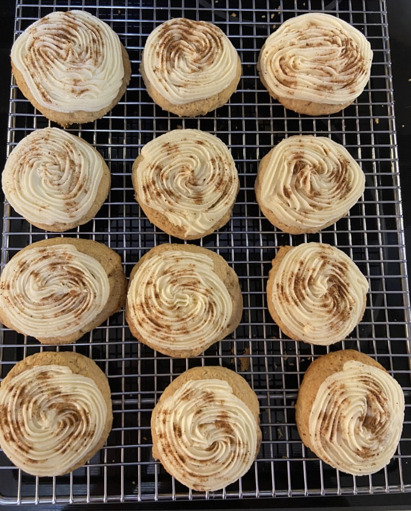
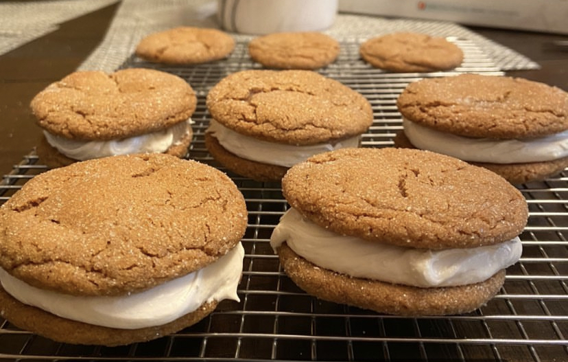

<!--more-->

> Recipes followed by the 🎄 emoji are Christmas favourites!

> Note: duplicate recipes are from different people & are different iterations on the same recipes.

## Chocolate Chip Cookies

*Nolan Baril*

**Ingredients**

-   2½ cups flour
-   1 tsp baking soda
-   1/2 tsp salt
-   3/4 cup brown sugar
-   3/4 cup sugar
-   2 eggs
-   1 cup margarine (softened, room temperature)
-   1 tsp vanilla extract
-   1½ cups chocolate chips

**Methods**

1.  Preheat oven at 375°F.
2.  Combine flour, baking soda and salt.
3.  In a large bowl combine margarine, sugars and vanilla. Cream mixture.
4.  Add one egg in at a time and beat until combined.
5.  Fold the flour mixture into the wet mixture. Stir in chocolate chips.
6.  Bake 8-10 minutes.

## Unbaked Cookies

*Lucette Sabourin*

**Ingredients**

-   4 cups oats
-   1/2 cup coconut
-   Cocoa powder (to brown)
-   2 cups white sugar
-   1/2 cup margarine
-   1/2 cup milk
-   1 tsp vanilla

**Methods**

1.  Combine oats, coconut and cocoa powder in a large bowl. Add enough cocoa powder to brown the oats.
2.  In a saucepan combine sugar, margarine, milk and vanilla and bring to a boil. Boil for 2 minutes.
3.  Immediately remove from heat and add to oat mixture.
4.  Serve in a bowl wet to eat or drop teaspoons on wax paper and let set for cookies.

## Monster Cookies

*Shannon Edel*

**Ingredients**

-   1½ cups margarine
-   3/4 cup white sugar
-   3/4 cup brown sugar
-   3 eggs
-   1½ tsp vanilla
-   1 tsp baking soda in a small amount of hot water
-   3 cups oatmeal
-   28g chocolate chips
-   1½ cups smarties
-   2¼ cups flour

> *Baking soda is added to a small amount of hot water to ensure it all dissolves*

**Methods**

1.  Preheat oven at 350°F.
2.  Beat margarine and sugars until they are fluffy.
3.  Add in eggs, one at a time, beating to incorporate after each addition.
4.  Add vanilla.
5.  Add oatmeal and baking soda; mix.
6.  Stir in chocolate chips and smarties
7.  Fold in the flour.
8.  Bake for 12 minutes.

## Fork Cookies

*Sarah Derksen*

**Ingredients**

-   1/2 cup margarine
-   1/2 cup shortening
-   1½ cup white sugar
-   2 eggs
-   2 tablespoons milk
-   1 teaspoon baking soda, mixed with 1 tsp. hot water
-   2 teaspoons vanilla
-   1 cup raisins, optional
-   3½ to 4 cups flour
-   1½ teaspoons cream of tartar, sifted into flour

**Methods**

1.  Mix margarine, shortening, sugar, eggs, milk in order given. Then add baking soda and vanilla.
2.  Sift together flour and cream of tartar, add to creamed mixture. Mix well, roll in balls and press with fork.
3.  Bake at 350°F until light golden.

## Fork Cookies

**Ingredients**

-   1 cup brown sugar
-   3/4 cup butter
-   1 egg, beaten
-   2 cups flour
-   1/2 tsp salt
-   1/2 tsp baking soda
-   1/2 tsp cream of tartar
-   1 tsp vanilla
-   1/2 cup broken walnuts or raisins

**Methods**

1.  Preheat oven at 350°F.
2.  Cream sugars, butter, egg and vanilla.
3.  In a separate bowl combine all other ingredients and add to wet mixture by folding.
4.  Place small ball of dough on a cookie sheet and press with fork.
5.  Bake until just light golden brown.

## Roll Kuchen

*Emmy Penner*

**Ingredients**

-   14 eggs
-   3 cups whipping cream
-   1 tbsp salt
-   Flour
-   Oil (for frying)

**Methods**

1.  Add oil (1 inch of oil; 1/2 inch from top of fryer) to fryer and let heat to high heat (450°F).
2.  Add eggs and whipping cream to a mixer.
3.  Beating gently, slowly add flour 1/2 cup at a time.
4.  Continue adding flour until the dough is soft and has elasticity.
5.  Roll out dough to about 1/4 inch thick.
6.  Cut into rectangles; cut slit into each one in the centre.
7.  Drop cut dough into hot oil and fry until golden brown.
8.  Remove from oil and let cool on paper towel.

> Roll kuchen can be served as is, with fruit (e.g., watermelon), jam, syrup or powdered sugar.

## Dad's Cookies

**Ingredients**

-   1 cup butter, room temperature
-   2 cups brown sugar
-   2 eggs
-   1 cup coconut
-   2 cups oatmeal
-   2 cups flour
-   1/2 tsp baking soda
-   1 tsp vanilla
-   2 tsp baking powder
-   Pinch of salt

**Methods**

1.  Preheat oven to 350°F.
2.  Cream butter and sugar until fluffy.
3.  Add eggs one at time, beating in between to incorporate. Add vanilla.
4.  Combine oatmeal, flour, coconut, baking soda, baking powder and salt in a separate bowl.
5.  Add dry ingredients to the butter-sugar mixture and fold to combine.
6.  Roll into balls using about a teaspoon of dough; flatten with a fork.
7.  Bake in oven until nicely browned.

## Soybutter Cookies

**Ingredients**

-   1 cup margarine
-   1 cup soybutter (e.g., Wowbutter)
-   1 cup white sugar
-   1 cup brown sugar
-   2 cups flour
-   2 eggs
-   1 tsp baking powder
-   1/2 tsp baking soda
-   1 tsp salt
-   2 cups chocolate chips

**Methods**

1.  Preheat oven at 350°F.
2.  Cream together margarine, soybutter, sugars and eggs; beat until creamy.
3.  Combine flour, baking powder and baking soda; fold into wet mixture.
4.  Fold in chocolate chips.
5.  Bake for 12 minutes.

## Ginger Snaps

*Emmy Penner*

**Ingredients**

-   2 cups flour
-   1 tbsp ginger
-   2 tsp baking soda
-   1 tsp cinnamon
-   1/2 tsp salt
-   3/4 cup shortening
-   1 cup sugar
-   1 egg
-   1/4 cup molasses
-   Sugar

**Methods**

1.  Preheat oven to 350°F.
2.  Cream shortening and sugar; beat in egg and molasses.
3.  Sift in dry ingredients and mix by folding.
4.  Form small balls and roll in sugar; place 2 inches apart on a baking tray.
5.  Bake for 12-15 minutes; cool on rack.

> These cookies will flatten during baking and look cracked on top.

## Ginger Snaps

*Evelyn Penner*

**Ingredients**

-   4 cups flour
-   2 teaspoons ginger
-   2 teaspoons cinnamon
-   1 teaspoon cloves
-   2 teaspoons baking powder
-   4 teaspoons baking soda
-   1 teaspoon salt
-   1½ cups margarine
-   2 cups white sugar
-   2 eggs
-   1 teaspoon vanilla extract

**Methods**

1.  Sift flour, cinnamon, ginger, cloves, baking soda, baking powder, and salt, set aside.
2.  Melt margarine and beat together with both sugars and eggs beat well, then add molasses.
3.  Add flour mixture to creamed sugars etc. Mix and roll into balls and dip into white sugar. Don't press down, they will flatten nicely.

## Baking Powder Biscuits

*Emmy Penner*

**Ingredients**

-   2½ cups sifted flour
-   4 tsp baking powder
-   1/2 tsp salt
-   1/3 cup shortening
-   3/4 cup milk

**Methods**

1.  Preheat oven at 450°F.
2.  Sift together flour, baking powder and salt.
3.  Cut in shortening with 2 knives.
4.  Add milk until dough is soft.
5.  Pat 1/2 inch thick on floured board and cut with 2 inch biscuit cutter (makes \~16 biscuits).
6.  Place on baking sheet and bake until brown, about 12-15 minutes.

## Baking Powder Biscuits

*Martha Penner*

**Ingredients**

-   2 cups white flour
-   4 teaspoons baking powder
-   1/2 teaspoon salt
-   1/3 cup canola oil
-   2/3 cup milk

**Methods**

1.  Sift and mix dry ingredients into a bowl. Drizzle oil into the flour, mix till crumb mixture forms, then add milk. Avoid over mixing.
2.  Roll out to about 1/2 in. thick. Cut into whatever shape you want. Bake at 450°F. for about 7 min.

## Orange Cookies

*Denis Baril*

**Ingredients**

-   3¾ cup flour
-   1 tsp baking powder
-   1 tsp baking soda
-   1 tsp ground cinnamon
-   1/4 tsp ground nutmeg
-   1½ cups sugar
-   1 cup butter or margarine, softened
-   2 large eggs
-   1 cup dairy or sour cream
-   Grated rind of 2 oranges
-   1/2 cup orange juice

**Methods**

1.  Preheat oven at 350°F.
2.  Whisk together flour, baking powder, baking soda, cinnamon and nutmeg.
3.  Beat sugar and butter until creamy; add eggs one at a time beating in between each addition.
4.  Add orange juice and rind; beat to mix.
5.  Add dry ingredients to wet and fold to mix.
6.  Drop dough by teaspoon onto a baking tray.
7.  Bake for 12-15 minutes.

## Iced Pumpkin Cookies

*Denis Baril*

**Ingredients**

-   2½ cups flour
-   1 tsp baking powder
-   1 tsp baking soda
-   2 tsp ground cinnamon
-   1/2 tsp ground nutmeg
-   1/2 tsp ground cloves
-   1/2 tsp salt
-   1/2 cup butter, softened
-   1½ cups white sugar
-   1 cup pumpkin
-   1 egg
-   1 tsp vanilla

Glaze:

-   2 cups icing sugar
-   1 tbsp melted butter
-   3 tbsp milk
-   1 tsp vanilla

**Methods**

1.  Preheat oven at 350°F,
2.  Combine flour, baking powder, baking soda, cinnamon, nutmeg, cloves and salt.
3.  Beat butter and white sugar together until creamy; add egg and vanilla. Add to dry ingredients.
4.  Drop on cookie sheet by tablespoonful; flatten slightly.
5.  Bake for 15-20 minutes. Cool.
6.  Combine icing sugar, milk, melted butter and vanilla, adding extra milk as needed. Beat.
7.  Drizzle glaze on top of cooled cookies.

## Eggnog Cookies 🎄

*Cole Baril*  

**Ingredients**

-   4 cups flour
-   4 tsp baking powder
-   1 tsp salt
-   1 tsp ground nutmeg
-   1 tsp ground cinnamon
-   1½ cup butter
-   1 cup sugar
-   1 cup brown sugar
-   4 egg yolks
-   2 tsp vanilla
-   1 tsp rum extract
-   1 cup full fat eggnog

Frosting:

-   1 cup butter (half salted, half unsalted)
-   6-10 tbsp full fat eggnog to consistency
-   1 tsp rum extract
-   6 cups powdered sugar

**Methods**

1.  Preheat oven to 350°F.
2.  Whisk together flour, baking powder, salt, nutmeg and cinnamon. Set aside.
3.  Beat together butter and sugar until fluffy; add in egg yolks one at a time blending after each addition. Mix in vanilla, rum extract and eggnog.
4.  Scoop dough by heaping tablespoon onto a baking sheet, spacing cookies 2 inches apart.
5.  Bake for 11-13 minutes. Allow to rest on baking sheet for a few minutes before transferring to a wire rack.
6.  For the frosting, beat the butter until pale and fluffy; add rum extract and 3 tbsp eggnog. Mix in powdered sugar 1/2 cup at a time. Add additional eggnog if needed for desired consistency.

## Christmas Sugar Cookies (Frosted Trees) 🎄

*Pauline* & *Barry*

**Ingredients**

-   2 cups flour
-   1/2 tsp nutmeg
-   1/2 tsp ginger
-   1/4 tsp baking powder
-   1/2 tsp salt
-   1 cup butter
-   1/2 cup icing sugar
-   2/3 cup icing sugar
-   2 tbsp water
-   Food colouring

**Methods**

1.  In a small bowl sift together flour, nutmeg, ginger, baking powder and salt.
2.  Blend butter and icing sugar in a separate bowl until light and fluffy.
3.  Add flour mixture to butter mixture 1/3 cup at a time; blend. Wrap and chill for 2 hours.
4.  Preheat oven to 350°F.
5.  Roll chilled dough to about 1/4 inch thick and cut out cookies with a cookie cutter.
6.  Place 1 inch apart on cookie sheet. Bake for 15-20 minutes until light brown.
7.  Mix 2/3 cup icing sugar, water and food colouring. Frost cooled cookies.

## Melting Shortbread 🎄

*Marie Remillard*

**Ingredients**

- 2 cups flour
- 1 cup icing sugar
- 1 lb. butter
- 1/2 cup cornstarch
- 1 teaspoon vanilla extract

**Methods**

1. Preheat oven at 350°F. 
2. Cream butter and add icing sugar, work together.
3. Sift flour and cornstarch. add to the creamed mixture.
4. Either drop from tablespoon or add a little more flour
and knead until it can be rolled, or put through cookie 
tube.
5. Bake until light brown, about 13 minutes.

## Oatmal Raisin Cookies

*Clara Wiebe (Red River Valley Lodge)*

**Ingredients**

- 1 cup margerine
- 1/4 cup white sugar
- 3/4 cup brown sugar
- 1 teaspoon vanilla
- 1 egg
- 1½ cup flour
- 1 teaspoon baking soda
- 1 3/4 cups oatmeal
- 1½ cups raisins

**Methods**

1. Preheat oven at 375°F.
2. Cream butter or margarine with sugars. Add eggs and vanilla and
 mix well. Add dry ingredients and blend well.
3. Stir in oatmeal, and raisins mix well. Drop dough by heaping 
teaspoons onto cookie sheet.
4. Bake for about 8-10 minutes.

> Mix a few hours before baking to allow oatmeal to adsorb the moisutre.

## Oatmeal Chocolate Chip Cookies 

*Clara Wiebe (Red River Valley Lodge)*

**Ingredients**

- 2 cups margarine
- 4 eggs
- 3/4 cup white sugar
- 1½ cups brown sugar
- 2 2/3 cups flour
- 2 teaspoons vanilla extract
- 2 teaspoons baking soda
- 4 cups oatmeal
- 2-3 cups chocolate chips

**Methods**

1. Preheat oven at 350°F.
2. Beat margarine, eggs, sugars and vanilla until light and fluffy.
3. Add dry ingredients and blend well. Stir in chocolate chips.
4. Drop by teaspoon onto un-greased cookie sheets.
5. Bake for about 8-10 minutes.

## Oatmeal Date Cookies 

*Caroline Buhr*

**Ingredients**

- 1 cup brown sugar
- 1 cup margerine
- 2 eggs
- 1 teaspoon vanilla
- 2 cups oatmeal
- 2 cups flour
- 1 teaspoon baking soda
- 3 teaspoons baking powder
- 1/2 teaspoon salt
- 2 - 3 cups dates, cooked

**Methods**

1. Preheat oven at 325°F.
2. Mix brown sugar, softened margarine, eggs and vanilla.
3. Add; oatmeal, flour, baking soda, baking powder and salt.
4. Mix and roll in balls, press flat with a glass.
5. Bake for about 7 minutes.
6. Let cool and put together with dates.

*This is a traditional recipe made by Emmy for years that has been passed down for three generations.*

## Soft Cocoa cookies

*Sarah Derksen*

**Ingredients**

- 1/2  cup margerine
- 1 cup brown sugar
- 1/2 cup cocoa
- 1 egg
- 2/3 cup milk
- 1/4 teaspoon salt
- 1 1/3 cup flour
- 3 teaspoons baking powder
- 1/2 cup coconut
- 1 teaspoon vanilla extract

**Methods**

1. Sift dry ingredients together and set aside.
2. Beat together margarine, sugar, egg, vanilla, and milk.
3. Mix together and drop by teaspoon onto un-greased cookie sheet.

> You may need to add 1/4 cup more flour. 

## Sour Cream Chocolate Chip Cookies

*Evelyn Penner*

**Ingredients**

- 2 cups brown sugar
- 1 cup margarine
- 2 eggs
- 1 cup sour cream 
- 4 cups flour
- 1 teaspoon baking powder
- 2 teaspoons baking soda
- 1 teaspoon vanilla extract
- 1 cup chocolate chips

**Methods**

1. Cream sugar, margarine, Add eggs and beat well.
Add sour cream and vanilla, mix well.
2. Sift together flour, baking powder, and baking soda.
Add to the creamed mixture and mix well. Then add
 chocolate chips.  Drop by teaspoon on baking sheet.
3. Bake at 350°F for about 7 min.

## Gingerbread Cookie Sandwiches 🎄 

*Cole Baril*  

**Ingredients**

Cookies:

- 2 1⁄4 cup flour
- 2 tsp ground ginger
- 2 tsp baking soda
- 1 tsp cinnamon
- 1 tsp ground cloves
- 1⁄4 tsp kosher salt
- 3⁄4 cup (170g) butter softened
- 1 cup brown sugar
- 1 large egg (room temp)
- 4 tbsp granulated sugar (for rolling)

Filling:

- 1 cup (227g) butter softened
- 1⁄2 tsp almond extract
- 1 pinch salt
- 4 cups icing sugar
- 1 jar marshmallow crème OR fluff

**Methods**

1. Cream butter until butter is light and fluffy (approx. 2 min).
2. Add almond extract and salt.
3. Add icing sugar 1⁄2 cup at a time. Mix on high for 2-3 min.
4. Fold in marshmallow crème by hand. Can be used immediately or refrigerated.
5. Spread filling on bottoms of half the cookies and top with the other half.