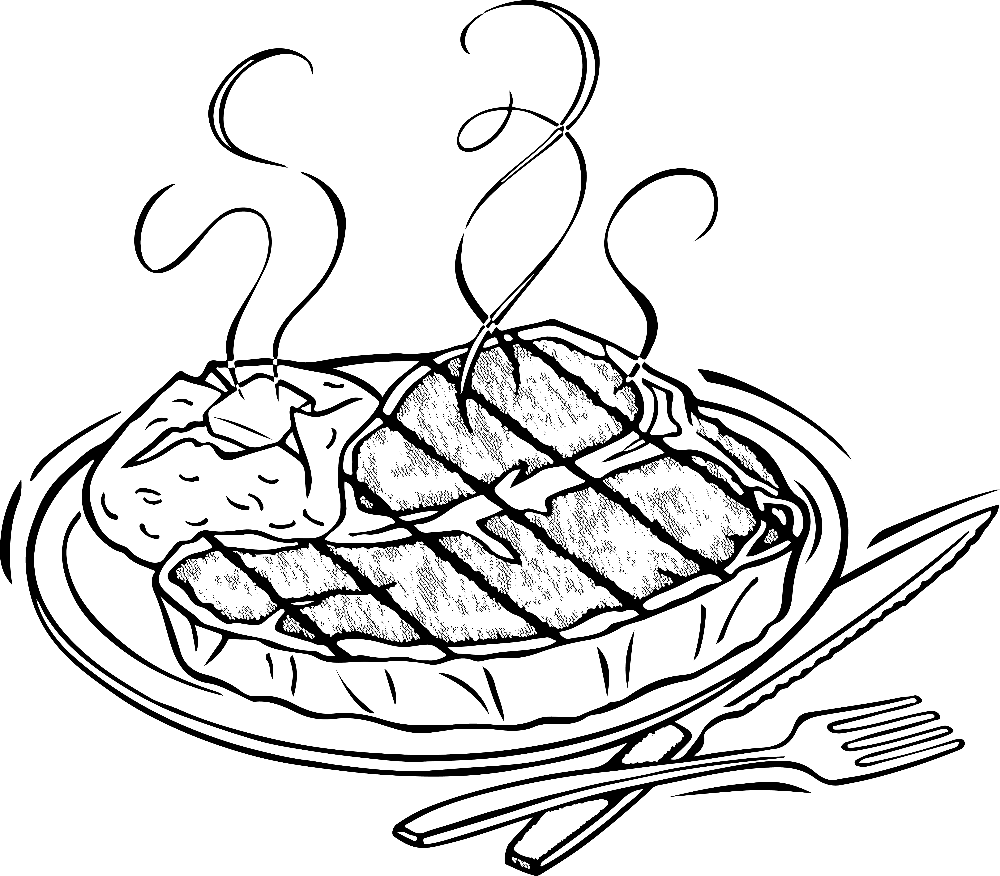

A collection of meat dish recipes from my cookbook. 

<!--more-->

## Sloppy Joes

**Ingredients**

-   1lb hamburger
-   Onion
-   Oil for frying
-   Salt
-   Pepper
-   2 tbsp flour
-   1¼ cup water
-   3 tbsp brown sugar
-   1 tin tomato soup
-   Chili powder

**Methods**

Combine ingredients in a large saucepan and cook thoroughly on medium heat.

## Chili

*Emmy Penner*

**Ingredients**

-   1½ pound ground beef
-   1-2 large onion
-   2 stalks celery
-   1/2 green pepper
-   2 28 oz.can or 796 ml. diced tomatoes
-   1 teaspoon black pepper
-   1 teaspoon salt
-   1 teaspoon oregano, as desired
-   1 teaspoon parsley , as desired
-   1 teaspoon chili powder, as desired
-   2-3 bay leaves
-   2 cups mixed vegetables, frozen
-   2 can beans of choice, drained
-   1 tablespoon brown sugar
-   2 garlic cloves, optional

**Methods**

1.  In frying pan brown beef, onions, garlic, celery, and peppers.
2.  Add tomatoes, black pepper, parsley, oregano, bay leaves, and chili powder. Simmer for a while.
3.  Add beans, vegetables, and brown sugar. Simmer for 15 - 20 minutes.

## Hamburger Casserole

**Ingredients**

-   2 cups Small egg noodles
-   1 lb ground beef
-   1 tbsp cooking oil
-   1 cup chopped onion
-   1/4 tsp garlic powder
-   2-7 oz tomato sauce
-   1 tsp salt
-   1/2 tsp pepper
-   1 cup sour cream
-   1 cup cottage cheese
-   1 cup shredded mozzarella cheese

**Methods**

1.  Prepare noodles as directed on the package. Drain and measure.
2.  Spread in the bottom of a 1½ quart casserole dish.
3.  Scramble fry beef in oil until brown; drain and discard fat.
4.  Add onion, garlic, tomato sauce, salt nd pepper to meat; simmer gently for 15 minutes and pour over noodles in casserole dish.
5.  Spread sour cream over meat, smoothing level and spoon cottage cheese on top.
6.  Layer cheese over top to cover completely.
7.  Bake uncovered in 350°F oven for 30 minutes until bubbly.

> Serves 6-8.

> *When discarding beef fat, pour into container and let solidify then discard in the garbage*.

## Potato and Sausage Casserole

*Emmy Penner*

**Ingredients**

- 6 medium potatoes, peeled and sliced
- 1 lb farmer sausage, peeled and sliced
- 1 tablespoon butter
- 1 tablespoon flour
- 1/4 teaspoon salt
- 1/2 cup milk
- 1/2 cup cheddar cheese
- 1 can mushroom soup
- Carrots and/or peas if desired

**Methods**

1. Arrange potatoes and farmer sausage in layers in a casserole
dish.
2. Melt butter; blend in flour, salt and milk gradually, stirring
constantly. 
3. Add cheese and soup. stirring until sauce cooks. Pour 
over potatoes and sausage.

## Chicken Parmigiana

*Vanessa Baril*

**Ingredients**

-   1/3 cup grated Parmesan cheese
-   1/3 cup fine dry bread crumbs
-   6 chicken breasts boned, skinned and flattened
-   Flour
-   1 egg beaten
-   Butter
-   1 can pizza sauce
-   250g mozzarella cheese

**Methods**

1.  Preheat oven to 350°F.
2.  Combine Parmesan cheese and crumbs.
3.  Lightly coat chicken with flour and dip in egg; coat with crumb mixture.
4.  Let stand 10 minutes to dry.
5.  Heat a small amount of butter in a frying pan and brown chicken a few pieces at a time, adding more butter as needed.
6.  Drain pan and spread half a can of pizza sauce in bottom of 2 quart shallow casserole dish.
7.  Place chicken breasts on pizza sauce layer and top with the remaining half can of pizza sauce and mozzerella cheese.
8.  Bake for 25-30 minutes.

## Swiss Chicken Casserole

**Ingredients**

-   6 chicken breasts
-   Swiss cheese
-   1 can mushroom soup
-   1/2 can boiling water
-   Fresh mushrooms
-   Stove top chicken stuffing

**Methods**

1.  Preheat oven to 350°F.
2.  Add chicken to casserole dish. If desired, but in half lengthwise.
3.  Add mushroom soup and boiling water.
4.  Layer with swiss cheese and add chicken stuffing on top.
5.  Bake for 45 minutes.

## Crispy Over Baked Chicken Tenders

**Ingredients**

-   1½ cups Panko breadcrumbs
-   Oil spray
-   1 egg
-   1 tbsp mayonnaise
-   1½ tbsp Dijon mustard
-   2 tbsp flour
-   1/2 tsp salt
-   Black pepper
-   1lb chicken tenderloins (1½cm thick slices lengthwise)

**Methods**

1.  Preheat oven to 390°F.
2.  Spread Panko onto baking tray and spray with oil; bake for 3-5 minutes until golden brown. Transfer to bowl.
3.  Place a rack on top of a baking tray to make cooking more even.
4.  Place egg, mayonnaise, dijon mustard, flour, salt and black pepper in a bowl and mix.
5.  Add chicken to the batter, then roll in the Panko crumbs. Spray with oil and sprinkle with a touch of salt.
6.  Bake for 15-20 minutes. Remove from oven and serve immediately.

## Pulled Pork

*Tannis Charette*

**Ingredients**

-   1 tbsp vegetable oil
-   2 onions finely chopped
-   6 cloves garlic minced
-   1 tbsp chili powder
-   1 tsp cracked black peppercorns
-   1 cup tomato-based chili sauce
-   1/4 cup packed brown sugar
-   1/4 cup cider vinegar
-   1 tbsp Worcestershire sauce
-   1 tbsp liquid smoke
-   1 boneless pork shoulder (3lbs)

**Methods**

1.  In a skillet heat oil and cook onions. Add garlic, chili powder and pepper. Cook 1 minute.
2.  Add chili sauce, brown sugar, vinegar, Worcestershire sauce and liquid smoke. Bring to boil.
3.  Add pork shoulder and sauce to a crock pot.
4.  Cook on low for 10 to 12 hours or high for 6 hours.

## Pulled Pork

*Karen Michta*

**Ingredients**

- 3-4 lbs. pork roast
- 2  cups root beer, as desired
- 1/2 cup BBQ sauce
- 1 package onion soup mix

**Methods**

1. Spray crock pot with cooking oil.
2. Combine root beer with 1/2 the BBQ sauce and onion soup mix.
Rub the pork roast with the sauce. Transfer to crock pot and pour 
the rest of the sauce over the roast.
3. Cook in slow cooker until done.
4. Reserve 2 cups of the sauce from the crock pot set aside.
5. Take meat out of stock pot and pull apart with 2 big forks. Set aside.
6. Dilute the other half of the BBQ sauce with the 2 cups drippings from the roast.
7. Put all back on crock pot and heat.

## Italian Meatballs

**Ingredients**

Sauce:

-   3/4 cup chopped onions
-   1 clove garlic, minced
-   3 tbsp salad oil
-   2 16 oz cans tomatoes
-   2 6 oz cans tomato paste
-   1½ tsp salt
-   1½ tsp dried oregano leaves
-   1 tsp sugar
-   1/2 tsp pepper
-   1 bay leaf

Meatballs:

-   4 slices of bread
-   1/2 cup water
-   2 beaten eggs
-   1/4 grated parmesan
-   2 tbsp snipped parsley
-   1 tsp salt
-   1/4 tsp oregano
-   1lb ground beef

**Methods**

1.  Cook onion and garlic in salad oil until tender *but not brown* in a pot.
2.  Stir in tomatoes, tomato paste, 2 cups of water, salt, oregano, sugar, pepper and top with bay leaf.
3.  Simmer uncovered for 30 minutes.
4.  Mix all meatball ingredients and form into 24 meatballs. Brown in a saucepan.
5.  Add browned meatballs to the pot. Cover and simmer for 30 minutes.
6.  Serve over cooked spaghetti.

## Ham and Cheese Ball

**Ingredients**

-   8 oz cream cheese
-   2 cans of flakes of ham
-   3 tbsp dried chives
-   1/2 tsp Worcestershire sauce
-   1/4 cup salad dressing (mayonnaise)
-   Parsley, chopped.

**Methods**

1.  Mix everything but parsley and refrigerate for 6 hours.
2.  Roll in chopped parsley flakes.

## Baked Pork Chops

*Emmy Penner*

**Ingredients**

-   2 large pork chops, 3/4 in bone in.
-   3/4 cup Panko bread crumbs
-   2½ tablespoons canola oil
-   1½ tablespoons grated Parmesan
-   1/2 teaspoon seasoning salt, (optional)
-   1/4-1/2 teaspoon pepper
-   1/4-1/2 teaspoon salt

**Methods**

1.  Preheat oven to 450°F.
2.  Combine Panko, oil, Parmesan, and all seasoning in a large resealable plastic bag.
3.  Place the pork chops in a large bowl and toss to coat with1 tablespoon water.
4.  Place the pork chops in the bag and shake well to coat, pressing the bread crumb mixture firmly into the meat.
5.  Place the pork chops on a wire rack set on a baking sheet and top evenly on with any remaining breadcrumbs remaining in the bag.
6.  Bake until the breadcrumbs are dark golden and the internal temperature of the chops registers 165°F. about 30 min. depending on thickness.

## Hamburgers / Meatballs

*Emmy Penner*

**Ingredients**

-   3 lbs. ground beef
-   1 package onion soup mix
-   2 eggs
-   3/4 cup oatmeal
-   2 tablespoons onion flakes
-   1 teaspoon pepper
-   1/2 teaspoon salt
-   1 cup water, cold

**Methods**

1.  Mix together onion soup, eggs, oatmeal, onion flakes, pepper, salt and water. Add to ground beef and mix well.
2.  Form into meatballs or hamburgers. Brown in frying pan or on cookie sheet in oven at 400°F for about 20 min. or until brown. These are also very good on the BBQ.

## Hawaiian Meatballs

*Emmy Penner*

**Ingredients**

-   3 lbs. ground beef
-   1 package onion soup mix
-   2 eggs
-   3/4 cup oatmeal
-   2 tablespoons onion flakes
-   1 teaspoon pepper
-   1/2 teaspoon salt
-   1 cup water, cold
-   2 tablespoons cornstarch
-   1 cup brown sugar
-   1/4 cup vinegar
-   1 cup ketchuo
-   1 cup water
-   1 tablespoon soy sauce
-   1/2 cup maraschino cherries
-   1 can pineapple chunks, drained

**Methods**

1.  Mix together onion soup, eggs, oatmeal, onion flakes, pepper, salt and cold water.
2.  Add to ground beef and mix well. Form into meatballs. Brown in oven at 400°F about 20 min.
3.  For sauce combine cornstarch, brown sugar, vinegar, ketchup, water and soy sauce. Cook over medium heat. Add cherries and pineapple.
4.  Place meatballs in casserole dish and cover with sauce and fruit mixture.
5.  Bake at 300°F for 30 min.

## Skillet Dinner

*Darlene Derksen*

**Ingredients**

- Meat (beef or poultry)
- Chopped onion
- Hot peppers
- Sliced garlic
- Chopped tomatoes
- Pasta of your choosing

**Methods**

1. Heat skillet.
2. Brown meat.
3. Add vegetables. 
4. Add pasta and just enough water to cover. 
5. Let simmer. 