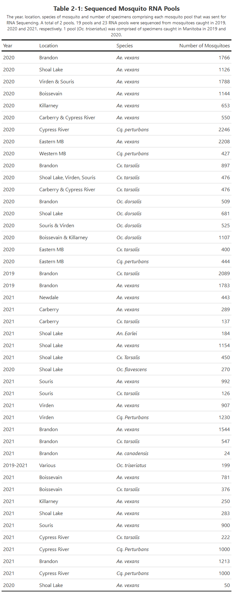

Publication in preparation.

A first-of-its kind study in Canada to identify the suite of pathogens harboured by mosquitoes in Manitoba using an [*a priori*](https://en.wikipedia.org/wiki/A_priori_and_a_posteriori) technique.

Authors: **Baril, C. W.**, Duncan, C., Sparrow, Chrest, B., J., Pilling, B., Mikkelsen, M., LaZerte, S., Cassone, B.J.

<!--more-->

## 1 Introduction

Mosquitoes transmit many arboviruses and parasites that cause significant human and veterinary morbidity and mortality around the globe (Ansari and Shope, 1994; Driggers et al., 2016; Evans and Peterson, 2019; Gan and Leo, 2014; Meier-Stephenson et al., 2006; Reimann et al., 2008; Weaver and Vasilakis, 2009). Of the global communicable disease burden, 17% of diseases are estimated to be caused by mosquito-borne pathogens and cause over 700,000 human deaths annually (W.H.O., 2020). Mosquitoes are distributed around the globe including in Arctic regions (Tolle, 2009; White et al., 2004). In Canada, the main MBD is West Nile virus (WNV). WNV infections can present as asymptomatic, cause mild flu-like symptoms and in severe cases neurological disease (PHAC, 2022). Since surveillance began in 2002 after the import of WNV to North America in 2001, 6,623 WNV human cases have been reported to the Public Health Agency of Canada as of 2021 (PHAC, 2022).

Mosquitoes do not just harbour arboviruses, but also harbour insect specific viruses (ISVs), which exhibit a restricted host range. ISVs have been isolated from a variety of insect orders including Diptera and Hemiptera. ISVs include a range of viral families including Bunyaviridae, Flaviviridae, Reoviridae, Rhabdoviridae, Togaviridae, Birnaviridae, Nodaviridae, Mesoniviridae and the newly described genus Negevirus. Many ISVs identified are restricted to specific insect families (e.g., Culicidae), however this could be due to the lack of study in other arthropods (Vasilakis & Tesh, 2015). ISVs have been understudied because of their inability to infect humans and other animals and consequently there has been little research into ISVs until recently. Recent findings demonstrating the connection between ISVs and human pathogens have sparked research interest into ISVs. For example, a study by Bolling et al. (2012) suggested that the presence of the ISV Culex flavivirus might compete with WNV and impact its transmission and risk to humans by lowering the WNV titer in mosquitoes co-infected with WNV and Culex flavivirus. One study has shown that Espirito Santo virus (Family: Birnaviridae) to be dependent on co-infection of Dengue virus (Family: Flaviviridae) in mosquitoes (Vancini et al., 2012). Many ISVs are understudied and their transmission cycle, human and veterinary impact, and interactions with arboviruses remains unknown.

Most of the widely used methods used to detect the presence of mosquito borne pathogens rely on a priori knowledge of the pathogen. For PCR based approaches, one must know the genetic sequence of the target microbe for primer design. For serological and antigen-based approaches, knowledge of the pathogen itself, its structure and its interaction with the immune system are required. While these methods are reliable for targeted diagnostics, for many microbes, this information is not readily available. Next generation sequencing (NGS) technology, however, allows for the detection of non-target sequences from RNA samples. For example, an entire mosquito's RNA can be isolated and sequenced to identify not only the transcriptome of the mosquito itself, but also the transcriptome of any microbes it is harbouring. This method is known as metatranscriptomic sequencing and has become a valuable tool for identifying microbes present in a sample of RNA and has been used on a diverse array of organisms including plants, insects, humans, and even water and soil samples. Another benefit of NGS technology compared to targeted approaches is in the power of the data it produces. Rather than amplifying a small amplicon as in PCR, with NGS it is possible to recover full transcripts and viral genomes for use in downstream bioinformatics analyses as we have done (Batson et al., 2021).

ISVs have been discovered at a fast rate since the advent of NGS technologies. Mosquito metatranscriptomic studies have taken place across the globe but have been concentrated where mosquito borne pathogens are problematic such as in China, and the USA, particularly in California. In all mosquito metatranscriptomic studies, it is common for tens of viruses to be identified, and in many cases many novel viruses are also identified. In a study by Batson et al., (2021), 70 viruses were sequenced from mosquitoes in California, USA, of which 46 were identified as novel viral species. They also sequenced, to a lesser extent, several protozoa, fungi, bacteria, plant, and vertebrate sequences. Chandler et al., (2015) conducted metatranscriptomic analysis of mosquitoes in California and identified viruses from a variety of families known to contain ISVs in addition to a variety of bacteria and fungal sequences were identified. Furthermore, Sadeghi et al., (2018) conducted metatranscriptomic analysis on Culex mosquitoes in California and sequenced 56 viruses including 32 novel viruses. Shi et al., (2016) conducted a widescale metatranscriptomic survey on over 220 invertebrate species in China including mosquitoes and identified 1,445 RNA viruses including novel viruses and viruses that made up new families of viruses, highlighting the vast diversity of the RNA virosphere among invertebrates. To our knowledge, similar studies have not been conducted in Manitoba. This study will add to the growing body of knowledge of ISVs and characterize the mosquito microbiome.

## 2 Methods

### 2.1 Mosquito Trapping

Mosquitoes were trapped using [CDC Miniature Light Traps](https://www.johnwhock.com/products/mosquito-sandfly-traps/new-standard-miniature-incandescent-light-trap/) with carbon dioxide (Model 1012, John W. Hock, Gainesville, FL). Carbon dioxide regulators were set to 15 psi. Traps were set approximately 5-6 feet off the ground hanging off a tree branch on the periphery of townsites and human dwellings. Traps were configured to turn on at dusk and stay on until dawn at which point the fan remains on to retain the catch. The light on the trap was disabled to reduce the number of non-mosquito insects trapped. Traps were operated twice weekly on Monday and Tuesday nights in 2020 and 2021 from June to August (week 23 to 36) in eight communities in Western Manitoba. In 2020, two traps were setup in each location except in Brandon where ten traps were deployed. In 2021, one trap was set up at each location. In total, there were 24 traps deployed twice weekly in 8 locations (2020) and 8 traps in 8 locations (2021). Traps were collected in the morning and live mosquitoes were transported to Brandon University where they were knocked down in a -20°C freezer and emptied into petri plates. Mosquitoes were immediately put into a -80°C freezer until identification.

To augment the analysis, mosquito specimens from 9 other locations throughout the province were collected via one-time satellite traps (CDC Light Traps) and provided to us by the City of Winnipeg Insect Control Branch. For samples provided by the Winnipeg Insect Control Branch, *Culex* mosquitoes were removed prior to receiving them.

### 2.2 Mosquito Identification

Five mosquito species were visually identified by researchers at Brandon University using dissecting microscopes in 2020 and nine mosquito species were visually identified in 2021. The five species were chosen because they were present in traps and known to transmit pathogens such as WNV and California Serogroup Viruses (CSGVs). The number of species under surveillance in 2021 increased because we decided to expand the scope of the study to investigate what microbes are harbored by additional species. Some mosquito specimens representing two mosquito species caught in Brandon in 2019 from June to August by Carlyn et al., 2019 (unpublished work) were also obtained. Specimens were identified using relevant mosquito identification keys (Carpenter and LaCasse, 1955; Thielman and Hunter, 2007; Wood et al., 1979). Mosquitoes were kept on dry ice during identification. Mosquito species identified included *Ochlerotatus dorsalis* Meigen, *Aedes vexans* Meigen, *Ochlerotatus flavescens* Muller, *Culex tarsalis* Coquillett, and *Coquillettidia perturbans* Walker in 2020 with the addition of *Aedes canadensis* Theobald, *Ochlerotatus trivittatus* Coquillett, *Ochlerotatus triseriatus* Say, and *Anopheles earlei* Vargus in 2021. Mosquitoes were sorted by species, location, and trapping date. A maximum of fifty mosquitoes of the same species and from the same location and date were pooled together per sample and stored at -80°C prior to RNA isolation. For traps with a high number of specimens, sub-samples of the trap were counted. Sub-sampling occurred when the trap contained approximately \>1,000 specimens. Total trap counts for sub-sampled traps were extrapolated by multiplying counts (e.g., counted 25% of the trap and multiplied by 4).

### 2.3 RNA Isolation

Total RNA was extracted from the mosquito pools using the Qiagen RNeasy Kit (Hilden, Germany) following the manufacturers protocol. We augmented the protocol with a Proteinase K incubation step to aid in tissue breakdown by diluting homogenized sample with 600 µl nuclease-free water and adding 25 µl of Proteinase K. In some cases, the presence of a brown precipitate was observed in RNA extraction products as described by Stapleton et al. (2016). To remove the precipitate, the Qiagen RNA PowerClean Pro Kit (Hilden, Germany) was used for all pooled samples intended for NGS to remove the precipitate and improve RNA quality. RNA quality checks were conducted using a NP80 Implen Nanophotometer.

### 2.4 RNA Sequencing

Mosquito RNA pools were combined by species, year, and location to form larger pools representing between 50 and \>2,000 mosquitoes (Table 2-1), and sent to Genome Quebec Innovation Centre (Montreal, QC, Canada) for cDNA synthesis using the mRNA stranded library preparation kit (NEB), adapter tagging, and RNA sequencing in 150 bp paired-end fashion using the NovaSeq 6000 platform (Illumina, San Diego, CA). The Illumina Analysis Package CASAVA 1.8.2 was used to perform bcl conversion and demultiplexing. Image deconvolution and quality value calculations were carried out using the Illumina GA pipeline (version 1.6).

> The following code block is to generate and format table 2-1 using the `gt()` R package using a basic MS Excel input.

```{r, include = FALSE, echo = FALSE}
library(readxl)
library(here)
library(knitr)
library(tidyverse)
library(janitor)
library(gt)
library(gtExtras)
library(webshot)

pools <- read_excel(here("data/raw/sequencepools.xlsx")) 

gtpools <- gt(pools) %>% 
  tab_options(
    table.border.top.color = "white",
    column_labels.border.top.width = 3,
    column_labels.border.top.color = "black",
    column_labels.border.bottom.width = 3,
    column_labels.border.bottom.color = "black",
    table_body.border.bottom.color = "black",
    table.width = pct(75)) %>% 
  tab_style(
    style = cell_text(style = "italic"),
    locations = cells_body(
      columns = Species
    )
  ) %>% 
  tab_header(
    title = md("**Table 2-1: Sequenced Mosquito RNA Pools**"),
    subtitle = md("The year, location, species of mosquito and number of specimens comprising each mosquito pool that was sent for RNA Sequencing. A total of 2 pools, 19 pools and 23 RNA pools were sequenced from mosquitoes caught in 2019, 2020 and 2021, respectively. 1 pool (*Oc. triseriatus*) was comprised of specimens caught in Manitoba in 2019 and 2020.")
  ) %>%
  gtsave(filename = "table2-1.png", zoom = 1)
```



### 2.5 Host and Quality Filtering

[Chan Zuckerberg ID](czid.org) Metagenomic Pipeline v6.8 (Chan Zuckerberg Biohub; CZID), an open-sourced cloud-based bioinformatics platform was used for quality control and host filtration of reads as well as *de novo* assembly and taxonomic binning as described by Batson et al., (2021) and Kalantar et al., (2020). The CZID pipeline employs STAR and Bowtie2 to perform host filtration (human and mosquito), Trimmomatic for adapter trimming, Price Seq for removal of low-quality reads, LZW for the removal of low complexity reads and CZIDdedup for duplicate read identification.

### 2.6 *De novo* Assembly

The host and quality filtered reads are allowed to continue through the CZID pipeline, which involves *de novo* assembly with SPADES using default settings and only the assembly module. After assembly, reads are mapped back to contigs with Bowtie2. Additionally, the host and quality filtered reads from CZID were downloaded and *de novo* assembled with the CLC Genomics Workbench version 20 assembler with a minimum contig length of 250 nt, mismatch cost of 2, insertion cost of 3, deletion cost of 3, length fraction of 0.7 and a similarity fraction of 0.95. Contigs were subject to BLASTn and BLASTp searches on the NCBI nt and nr databases, respectively. The BLAST results were very similar between CZID and CLC, thus we opted to use CLC Genomics Workbench version 20 for subsequent analyses.

### 2.7 BLAST

Assembled contigs were subject to [BLAST](https://blast.ncbi.nlm.nih.gov/Blast.cgi) searches on the NCBI non-redundant nucleotide and protein databases, respectively and contigs were assigned to taxa based on BLAST results. Positive contigs from BLASTn searches were searched against the BLASTp database on a per-sequence basis to save computational time. We were looking for non-mosquito sequences of viral, bacterial, parasitic, fungal and plant origin and discarded sequences that were of mosquito origin.

### 2.8 Analysis of BLAST Results

To begin, BLASTn search results were filtered by E-value (≤1x 10<sup>-100</sup>) and contig length (≥250). Contigs with a match length of ≥250 nt and ≥90% for both nt and aa sequence similarity were classified as hits. Coverage depth was analyzed on a per-sequence basis: for viruses, we used a minimum threshold of 10X coverage depth, and we were less strict for protozoan, fungal, bacterial, plant and chordate read. Contigs meeting these criteria were further scrutinized through analysis of protein function using the NCBI ORFfinder (minimum length: 150 nt, standard genetic code, "ATG" only) and NCBI conserved domains tools. The most likely ORF was used for analysis based on the NCBI ORFfinder output.

Contigs with a percent nt identity of \<90% were flagged as potentially novel and were subject to phylogenetic analysis. While the ICTV sets specific standards for different viral taxa for percent identity to claim a novel virus, many of the viruses we recovered are unclassified beyond the order or family classification, which can make selecting an identity threshold difficult. Therefore, we selected \<90% as the cut-off because Kalantar et al., (2020) suggests that \<90% nt identity is a good general threshold.

### 2.9 Phylogenetic Analysis of Novel Viruses

A group of ORF-predicted protein sequences related to the query sequence were collected and aligned with MEGAX using ClustalW. GBlocks was used to trim the alignment using options for a less stringent selection. Next, a maximum likelihood tree (unrooted) was inferred using MEGAX using the Whelan and Goldman + frequency model to produce the final tree with 1,000 bootstrap replicates. We classified \<90% bootstrap support as low support, 90-94% bootstrap support as moderate support and 95-100% bootstrap support as high support.

## 3 Results

Of a total of 3,382,675,290 reads (average of 75,170,562 reads per sample) sequenced from 45 mosquito samples, 3,127,343,660 reads (92.45%) passed quality filters. Contig filtering was carried out post-BLASTn. Contigs were determined to be a positive match to a given taxon if the E-value was ≤1x10<sup>-100</sup>, the alignment length to a sequence in the nt database was  ≥250 bp, the percent nucleotide identity was ≥90%, and the average coverage depth was ≥10X. Based on these parameters, 4,956,079 reads were determined to be viral. 80.52% of viral reads mapped to contigs aligning with positive sense single stranded RNA viruses, 6.08% of viral reads mapped to contigs aligning with negative sense single stranded RNA viruses, 13.03% of viral reads mapped to contigs aligning with double stranded RNA viruses and 0.36% of viral reads mapped to contigs aligning with single stranded DNA viruses (Figure 2-1). 33 unique viruses were sequenced of which 12 consisted of (-)ssRNA genomes, 20 consisted of (+)ssRNA genomes, 2 consisted of dsRNA genomes and one virus had a ssDNA genome (Figure 2-2).

## 4 Discussion

## 5 Conclusions

## 6 Acknowledgements

We would like to thank the Public Health Agency of Canada for funding, Manitoba Health for trapping supplies and access to trapping sites, and the Winnipeg Insect Control Branch for providing specimens.

## 7 References
