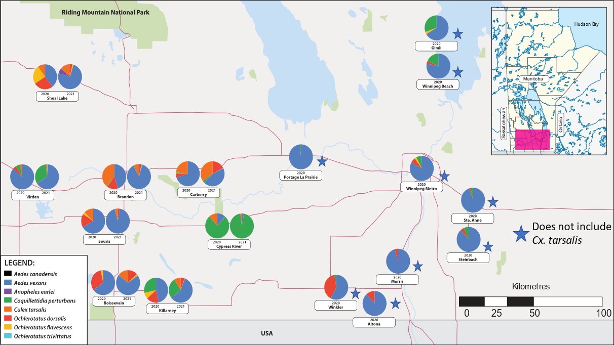

Chapter 1 of my thesis. 

An analysis of the relationships between mosquitoes and weather variables in Manitoba, Canada.

Authors: **Baril, C. W.**, Koloski, C.W., Duncan, C., Sparrow, J., Pilling, B., Mikkelsen, M., LaZerte, S., Cassone, B.J.

<!--more-->

## 1 Introduction

The IPCC (2018) has stated that mosquito borne diseases (MBDs) are the group of diseases that will be most impacted by climate change. Mosquito range, habitat and density will increase as temperatures warm and precipitation patterns change. In turn, this can lead to increases in density of mosquitoes already present in an area and increase the burden of MBDs. In Canada, the MBD burden has already increased by 10% in the last 20 years and this trend is expected to continue (Ludwig et al., 2019). Furthermore, climate change will facilitate continued northward expansion of mosquito vectors not already present in a given area and result in the introduction of pathogens novel to geographic regions. For example, the northbound range of *Aedes aegypti* Linnaeus, which is associated with 54 viruses and *Plasmodium* parasite transmission, stretches from the southern US states upwards towards the northeastern US states and southeastern Canada (Kraemer et al., 2015). Additionally, the cold-tolerant *Aedes albopictus* Skuse has moved farther north into the US and Canada (Kraemer et al., 2015). Both *Ae. aegypti* and *Ae. albopictus* have been found in Eastern Canada during routine surveillance, however, species establishment in these areas has not occurred (CBC, 2018; Lowe et al., 2021). This highlights the importance of a comprehensive mosquito surveillance program and understanding how mosquitoes respond to varying weather variables. Combined, surveillance and weather modelling allow for advanced warning and detection and of mosquito vector presence and density and allows for timely mosquito control measures and public health warnings to be issued.

In Manitoba, the [City of Winnipeg](https://winnipeg.ca/publicworks/insectControl/default.stm) and [City of Brandon](https://www.brandon.ca/mosquito-abatement/mosquito-abatement-program) conduct adult and larval mosquito surveillance for nuisance mosquitoes as well as *Culex tarsalis* Coquillett. These surveillance programs inform when and where mosquito larvicide and adulticide measures are implemented and considers the full suite of factors that affect mosquito abundance (e.g., temperature, degree day models, precipitation, larval development sites; City of Winnipeg, 2020). West Nile Virus (WNV) surveillance and modelling is conducted by [Manitoba Health](https://www.gov.mb.ca/health/wnv/) and utilizes specimens and data collected by the City of Winnipeg and City of Brandon. Pools of *Cx. tarsalis*, the main WNV mosquito vector in Manitoba, are screened for WNV. Using the number of positive WNV *Cx. tarsalis* pools, *Cx. tarsalis* trap counts, human population density, time of the year, incorporating weather modelling, and corvid and human WNV cases, Manitoba Health is responsible for making decisions about enhancing WNV surveillance, increasing larvicide and adulticide measures by issuing mosquito control under an Order if a public health threat exists. Under a provincially issued Order for mosquito control, buffer zones may be ignored to ensure thorough adulticide application (Manitoba Health, 2022).

While Manitoba Health has a thorough WNV and *Cx. tarsalis* surveillance program, there is no mosquito surveillance and modelling carried out for other species which may vector pathogens in Manitoba such as Aedes, Ochlerotatus and *Coquillettidia* species which can vector California serogroup viruses (CSGVs), a group of emerging mosquito-borne viruses in Canada (Drebot, 2015). Furthermore, to our knowledge, no recent comprehensive surveillance studies have been conducted in Western Manitoba. Next, the benefits of a comprehensive mosquito surveillance program with personnel trained in mosquito identification, particularly mosquitoes that are difficult to identify, can provide critical insights into the presence of disease vectors. For example, *Ochlerotatus triseriatus* Say, the main vector of La Crosse virus, was identified out of the range of its eastern bounds in Manitoba in 2008 and from traps in 2019 and 2020 (Koloski et al., 2021; McMahon TJ et al., 2008). *Oc. triseriatus* is a relatively rare species in Manitoba and is a difficult to identify mosquito species, requiring a trained eye and in some cases molecular identification.

Mosquitoes have a complex life cycle and specific climate, weather, and habitat requirements. After adult females emerge from their pupal stage, they must mate with a male and obtain a bloodmeal to produce eggs, which usually occurs within a couple days after emergence (Wood et al., 1979). *Aedes* and *Ochlerotatus* females lay eggs on moist surfaces that will eventually flood in the spring due to snowmelt and create vernal pools (e.g., spring Aedes) or become flooded due to precipitation (e.g., summer *Aedes*). Some species, such as *Oc. triseriatus*, lay eggs in tree holes or in man-made containers. *Aedes* and *Ochlerotatus* eggs are desiccation resistant and subsequently hatch when inundated with water and when weather conditions are conducive to hatching (e.g., temperature, humidity), or, if eggs do not hatch, they can lay dormant and/or overwinter. Conversely, *Culex* females lay eggs on standing water (e.g., man-made containers, ditches, ponds, marshes) in the form of an egg raft consisting of 100-300 eggs and then hatch within two days. *Culex* females overwinter in the adult stage, hibernating in empty logs, caves, or in manmade structures (Wood et al., 1979). Often, this results in a later emergence of *Culex* mosquitoes compared to Aedes/Ochlerotatus mosquitoes as they must lay eggs, where *Aedes*/*Ochlerotatus* eggs are already laid and ready to hatch in the spring. Coquillettidia females lay eggs in pools of standing water containing vegetation such as cattails (*Typha latifolia*), which larvae use to obtain nutrients and oxygen by attaching their siphon to the roots (Poirier and Berry, 2011). Coquillettidia overwinter in the larval stage and are univoltine, occurring in from June to early September in Manitoba before newly hatched larva enter diapause as temperatures cool (Wood et al., 1979).

For most mosquito species, there exists an optimal temperature range, where they are metabolically inactive below the lower end, and die or seek shelter at the higher end. For *Ae. vexans*, the minimum metabolic threshold is thought to be 12℃, while *Ae. vexans*abundance was found to peak at 26.4℃ for *Ae. vexans* studied in South Korea (Lim et al., 2021; Ripoche et al., 2019). For *Cx. tarsalis* (considered a "hot temperature species") and *Cq. perturbans* (considered a "cold temperature species"), the minimum metabolic threshold is about 10℃ (Manitoba Health; Beadle, n.d.; Ripoche et al., 2019). For all mosquito species, high humidity is favoured because they are susceptible to desiccation at the adult stage. At lower levels of humidity, mosquitoes can dry out or avoid host-seeking to seek shelter to avoid desiccation (Holmes and Benoit, 2019).

Furthermore, precipitation is an important weather variable for all mosquito species because their larvae and pupae are aquatic (Wood et al., 1979). However, there are some differences in requirements between genera. *Aedes* lay their eggs in areas that will be flooded either by spring snowmelt or precipitation, which hatch when they become inundated and other conditions such as temperature and humidity are optimal. On the other hand, Culex mosquitoes lay their eggs directly on standing water. In both cases, an increase in precipitation will lead to an increase in mosquito habitat area and relative humidity, which increases abundance. Furthermore, a reduction in precipitation can increase the presence of standing water as rivers and streams dry up, therefore providing more mosquito habitat. Previous studies have associated mosquito abundance with temperature and precipitation. For instance, temperature and precipitation are commonly utilized as parameters in other mosquito weather models in Canada: increased temperature, in general, leads to an increase in mosquito density and activity (Ogden et al., 2019). Furthermore, both increases and decrease in precipitation can lead to increased mosquito habitat: with increased precipitation, standing water (e.g., pools, ditches, rain barrels) leads to increased mosquito breeding, while a decrease in precipitation can lead streams and rivers to dry up, resulting in standing water, which is suitable habitat for mosquitoes to lay eggs in (Ogden et al., 2019). It is common for seasonal population dynamics of mosquitoes to vary considerably between genera and even species. For example, in one study in Quebec, *Ae. vexans* was associated with mean degree days in the 24 days preceding trap date and mean precipitation 30 days prior to the trap date. Conversely, *Cx. pipiens*-*restuans* was associated with mean degree days 22 days prior to the trapping date and precipitation 71 days prior to the trapping date (Ripoche et al., 2019).

This study will identify mosquito activity from two years of mosquito surveillance including for neglected mosquito vectors (e.g., namely *Ae. vexans*, *Cq. perturbans*, and *Oc. dorsalis*). The activity of each species will be compared between species and year and relationships with temperature, precipitation and relative humidity will be evaluated using GLMMs. This chapter will provide insights into mosquito activity in Manitoba and factors that drive mosquito populations in Manitoba.

## 2 Methods

### 2.1 Mosquito Trapping

Mosquitoes were trapped using [CDC Miniature Light Traps](https://www.johnwhock.com/products/mosquito-sandfly-traps/new-standard-miniature-incandescent-light-trap/) with carbon dioxide (Model 1012, John W. Hock, Gainesville, FL). Carbon dioxide regulators were set to 15 psi. Traps were set approximately 5-6 feet off the ground hanging off a tree branch on the periphery of townsites and human dwellings. Traps were configured to turn on at dusk and stay on until dawn at which point the fan remains on to retain the catch. The light on the trap was disabled to reduce the number of non-mosquito insects trapped. Traps were operated twice weekly on Monday and Tuesday nights in 2020 and 2021 from June to August (week 23 to 36) in eight communities in Western Manitoba. In 2020, two traps were setup in each location except in Brandon where ten traps were deployed. In 2021, one trap was set up at each location. In total, there were 24 traps deployed twice weekly in 8 locations (2020) and 8 traps in 8 locations (2021) (Table 5 1; Figure 1-2). Traps were collected in the morning and live mosquitoes were transported to Brandon University where they were knocked down in a -20°C freezer and emptied into petri plates. Mosquitoes were immediately put into a -80°C freezer until identification.

To augment the analysis, mosquito specimens from 9 other locations throughout the province were collected via one-time satellite traps (CDC Light Traps) and provided to us by the City of Winnipeg Insect Control Branch (Table 5 2; Figure 1-2). For samples provided by the Winnipeg Insect Control Branch, *Culex* mosquitoes were removed prior to receiving them.

### 2.2 Mosquito Identification

Five mosquito species were visually identified by researchers at Brandon University using dissecting microscopes in 2020 and nine mosquito species were visually identified in 2021. The five species were chosen because they were present in traps and known to transmit pathogens such as WNV and California Serogroup Viruses (CSGVs). The number of species under surveillance in 2021 increased because we decided to expand the scope of the study to investigate what microbes are harbored by additional species. Some mosquito specimens representing two mosquito species caught in Brandon in 2019 from June to August by Carlyn et al., 2019 (unpublished work) were also obtained. Specimens were identified using relevant mosquito identification keys (Carpenter and LaCasse, 1955; Thielman and Hunter, 2007; Wood et al., 1979). Mosquitoes were kept on dry ice during identification. Mosquito species identified included *Ochlerotatus dorsalis* Meigen, *Aedes vexans* Meigen, *Ochlerotatus flavescens* Muller, *Culex tarsalis* Coquillett, and *Coquillettidia perturbans* Walker in 2020 with the addition of *Aedes canadensis* Theobald, *Ochlerotatus trivittatus* Coquillett, *Ochlerotatus triseriatus* Say, and *Anopheles earlei* Vargus in 2021. Mosquitoes were sorted by species, location, and trapping date. A maximum of fifty mosquitoes of the same species and from the same location and date were pooled together per sample and stored at -80°C prior to RNA isolation. For traps with a high number of specimens, sub-samples of the trap were counted. Sub-sampling occurred when the trap contained approximately \>1,000 specimens. Total trap counts for sub-sampled traps were extrapolated by multiplying counts (e.g., counted 25% of the trap and multiplied by 4).

### 2.3 Data

Weather data were obtained from the closest Environment Canada weather station to the trapping location. In some cases, the same weather station serviced multiple towns, however, for these stations, there has historically been an insignificant difference observed between the two towns (Environment Canada, personal communication). The distances between trapping locations and the closest servicing weather station can be found in the Appendix and ranged from 0-66km away from the trapping site. Explanatory variables included ddm14 (mean growing degree days 14 days preceding the sampling date), ppm14 (mean precipitation 14 days preceding the sampling date) and rhm14 (mean relative humidity 14 days prior to the sampling date). We chose to use a two-week lag period because of the 10--14-day life cycle of a mosquito and we wanted to know how the conditions during the mosquito life cycle impact its development (Lim et al., 2021; Wood et al., 1979). However, while one to two weeks is standard from egg to adult, increasing or decreasing temperatures can alter the life cycle to one week to a few days in hot weather, or prolong it by weeks to months in cool weather. The mean degree days two weeks prior to trapping (ddm14) was calculated based on the formula used by Ripoche et al., (2019): ddm14 = number of degrees above the minimum growth temperature threshold (Tbase): if the mean daily temperature Tmean \> Tbase, then dd = Tmean−Tbase, and if Tmean \< Tbase then dd = 0°C, where Tbase = baseline metabolic temperature for mosquito growth and Tmean = the mean temperature on the trapping date. For Tbase, we used 12℃ for *Ae. vexans* (Ripoche et al., 2019), 10℃ for *Cx. tarsalis* (Ripoche et al., 2019, Manitoba Health), 10℃ for *Cq. perturbans* (Beadle, n.d.) and 12℃ for *Oc. dorsalis*. Growing degree days were used because it incorporates minimum metabolic temperatures for mosquito activity and temperature. This is important because under a mosquito's base temperature, its activity will cease and its development pauses. By using growing degree days, we account for time that accumulated with temperatures that fosters mosquito growth and development.

### 2.4 Statistical Analyses

Relationships among environmental variables and number of mosquitoes trapped over two years (2020 and 2021) were assessed with [R statistical software](https://www.r-project.org/) (v4.1.2; R Core Team, 2021). We explored two different sets of models: 1) differences among mosquito species trap counts; and 2) effects of average degree days, relative humidity, precipitation, and time (week) on mosquito trap counts. All models were Generalized Linear Mixed Models (GLMMs; [glmmTMB package v1.1.2.3](https://www.rdocumentation.org/packages/glmmTMB/versions/1.1.4/topics/glmmTMB); Brooks et al., 2017), using a negative binomial distribution and random intercepts for site to control for site-level effects. We used a negative binomial distribution because we have count data, but they did not match a Poisson distribution. Type III ANOVA tables were computed with the [car package](https://www.rdocumentation.org/packages/car/versions/3.1-0) (v3.0.12; Fox and Weisenberg, 2019) and used to assess polynomial terms. Non-significant, 2nd order polynomial terms were omitted from the models.

Differences in trap counts among species were modelled using the complete data set with trap counts as the response and species, year, and their interaction explanatory variables. We also included minimum temperature of the trap-day as a covariate because mosquito activity decreases during periods of low temperatures. We conducted Post-Hoc analyses to compare species difference among years ([emmeans package v1.7.0](https://www.rdocumentation.org/packages/emmeans/versions/1.7.5/topics/emmeans); Lenth 2021) with the false discovery rate P-value adjustment.

Preliminary exploration suggested that trap count differences with local weather variation were species-specific. Preliminary exploration was conducted by visualizing the distribution of mosquito trapping events in time and space. Trap counts over time for each trapping event was visualized using histograms and plotting mosquito trap counts along with weather variables. Furthermore, the distribution of trap counts was fitted to a negative binomial distribution at this stage using the [fitdistrplus package](https://cran.r-project.org/web/packages/fitdistrplus/index.html). Therefore, we modelled weather variables separately for each species. To account for curvilinear relationships, variables were modelled as 2nd degree orthologonal polynomials. We also included year and minimum temperature of the trap-day as linear covariates. Sixteen sites were incorporated into the analysis we excluded the Cypress River site due to outlier effects: trap counts for Cq. perturbans were significantly higher in Cypress River compared to all other sites and we believe that this increase is due to habitat effects rather than weather variables, which we not attempting to measure.

All model fits and assumptions were assessed with the [DHARMa package](https://www.rdocumentation.org/packages/DHARMa/versions/0.4.5) (v0.4.4; Hartig, 2021); multicollinearity was assessed with the [performance package](https://www.rdocumentation.org/packages/performance/versions/0.9.1) (v0.8.0; Lüdecke et al., 2021); and figures were created with the [ggplot2 package](https://ggplot2.tidyverse.org/) (v3.3.5; Wickham, 2016). Note that figure scales are log10 transformed after first adding 1 to better visualize patterns.

## 3 Results

### 3.1 Mosquito Activity

#### 3.1.1 2020

In 2020, approximately 150,000 mosquitoes (estimated from sub-sampling) were collected from 17 communities in Manitoba from June 1 to September 1 (week 23 to 36). In Cypress River and Virden, collections were stopped after August 25th due to very low trap counts. Most of the mosquitoes were trapped from July to mid-August in 2020 and towards the end of June and early July in 2021 (Figure 3-1). Of a total of approximately 121,000 mosquitoes collected in eight communities in West Manitoba in 2020, approximately 50,000 mosquitoes representing five species: *Ae. vexans*, *Oc. dorsalis*, *Oc. flavescens*, *Cx. tarsalis*, and *Cq. perturbans*. *Ae. vexans* was the most numerous species among the five identified and represented 41% of mosquitoes identified. *Ae. vexans* was followed by *Cq. perturbans*, *Cx. tarsalis*, *Oc. dorsalis*, and *Oc. flavescens* which represented 30%, 15%, 10%, and 3% of species identified, respectively (Table 3-1; Table 3-2). Trap counts were highest in mid-July which triggered the City of Brandon to fog on July 16th and 17th, after which a slow decrease in mosquito activity was observed (Figure 3-1). Note that the majority of *Cq. perturbans* were trapped in Cypress River. Of the remaining 28,494 specimens supplied to us from Eastern Manitoba (Winnipeg Insect Control Branch), 10,491 were identified to represent five mosquito species caught at various time-points from June 1<sup>st</sup> to September 1<sup>st</sup>, 2020. Of the identified species, Ae. vexans was predominant, representing 77.3%. Following *Ae. vexans* was *Cx. tarsalis* at 9.8%, *Oc. dorsalis* at 7.1%, *Cq. perturbans* at 5.0%, and *Oc. flavescens* at 0.9%. The number of *Cx. tarsalis* specimens is lower than the actual number due to *Cx. tarsalis* being largely removed prior to receiving the trap.


<table>
  <caption><strong>Table 3-1.</strong> Weekly number of mosquitoes trapped. The total number of five mosquito species trapped in eight communities in Western Manitoba from June 1<sup>st</sup> to September 1<sup>st</sup>, 2020</caption>
  <tr>
    <th>Week</th>
    <th><em>Ae. vexans</em></th>
    <th><em>Oc. dorsalis</em></th>
    <th><em>Oc. flavescens</em></th>
    <th><em>Cx. tarsalis</em></th>
    <th><em>Cq. perturbans</em></th>
    <th>Total</th>
  </tr>
  <tr>
    <td>22</td>
    <td>238</td>
    <td>1933</td>
    <td>0</td>
    <td>0</td>
    <td>0</td>
    <td>2171</td>
  </tr>
  <tr>
    <td>23</td>
    <td>753</td>
    <td>774</td>
    <td>222</td>
    <td>15</td>
    <td>146</td>
    <td>1910</td>
  </tr>
  <tr>
    <td>24</td>
    <td>563</td>
    <td>199</td>
    <td>488</td>
    <td>10</td>
    <td>2878</td>
    <td>4138</td>
  </tr>
  <tr>
    <td>25</td>
    <td>520</td>
    <td>61</td>
    <td>361</td>
    <td>5</td>
    <td>1735</td>
    <td>2682</td>
  </tr>
  <tr>
    <td>26</td>
    <td>255</td>
    <td>6</td>
    <td>155</td>
    <td>42</td>
    <td>4029</td>
    <td>4487</td>
  </tr>
  <tr>
    <td>27</td>
    <td>2038</td>
    <td>351</td>
    <td>295</td>
    <td>363</td>
    <td>727</td>
    <td>3774</td>
  </tr>
  <tr>
    <td>28</td>
    <td>8470</td>
    <td>1170</td>
    <td>82</td>
    <td>1403</td>
    <td>565</td>
    <td>11690</td>
  </tr>
  <tr>
    <td>29</td>
    <td>2995</td>
    <td>332</td>
    <td>1</td>
    <td>2114</td>
    <td>3757</td>
    <td>9199</td>
  </tr>
  <tr>
    <td>30</td>
    <td>789</td>
    <td>163</td>
    <td>0</td>
    <td>1445</td>
    <td>325</td>
    <td>2722</td>
  </tr>
  <tr>
    <td>31</td>
    <td>2533</td>
    <td>88</td>
    <td>0</td>
    <td>1170</td>
    <td>1022</td>
    <td>4813</td>
  </tr>
  <tr>
    <td>32</td>
    <td>1037</td>
    <td>57</td>
    <td>0</td>
    <td>929</td>
    <td>21</td>
    <td>2044</td>
  </tr>
  <tr>
    <td>33</td>
    <td>472</td>
    <td>7</td>
    <td>0</td>
    <td>59</td>
    <td>0</td>
    <td>538</td>
  </tr>
  <tr>
    <td>34</td>
    <td>146</td>
    <td>16</td>
    <td>0</td>
    <td>41</td>
    <td>0</td>
    <td>203</td>
  </tr>
  <tr>
    <td>35</td>
    <td>90</td>
    <td>24</td>
    <td>0</td>
    <td>13</td>
    <td>0</td>
    <td>127</td>
  </tr>
  <tr>
    <td>Total</td>
    <td>20899</td>
    <td>5181</td>
    <td>1604</td>
    <td>7609</td>
    <td>15205</td>
    <td>50498</td>
  </tr>
</table>

<table>
  <caption><strong>Table 3-2.</strong> Number of mosquitoes trapped by location in 2020. The total number of five mosquito species trapped in eight communities in Western Manitoba from June 1<sup>st</sup> to September 1<sup>st</sup>, 2020</caption>
  <tr>
    <th>Week</th>
    <th><em>Ae. vexans</em></th>
    <th><em>Oc. dorsalis</em></th>
    <th><em>Oc. flavescens</em></th>
    <th><em>Cx. tarsalis</em></th>
    <th><em>Cq. perturbans</em></th>
    <th>Total</th>
  </tr>
  <tr>
    <td>Boissevain</td>
    <td>2192</td>
    <td>1067</td>
    <td>113</td>
    <td>136</td>
    <td>0</td>
    <td>3508</td>
  </tr>
  <tr>
    <td>Brandon</td>
    <td>4278</td>
    <td>1408</td>
    <td>30</td>
    <td>3666</td>
    <td>130</td>
    <td>9512</td>
  </tr>
  <tr>
    <td>Carberry</td>
    <td>899</td>
    <td>71</td>
    <td>12</td>
    <td>290</td>
    <td>12</td>
    <td>1284</td>
  </tr>
  <tr>
    <td>Cypress River</td>
    <td>2099</td>
    <td>49</td>
    <td>29</td>
    <td>2120</td>
    <td>14103</td>
    <td>18400</td>
  </tr>
  <tr>
    <td>Killarney</td>
    <td>931</td>
    <td>329</td>
    <td>160</td>
    <td>183</td>
    <td>568</td>
    <td>2171</td>
  </tr>
  <tr>
    <td>Shoal Lake</td>
    <td>1851</td>
    <td>1215</td>
    <td>1124</td>
    <td>469</td>
    <td>3</td>
    <td>4662</td>
  </tr>
  <tr>
    <td>Souris</td>
    <td>2858</td>
    <td>733</td>
    <td>132</td>
    <td>535</td>
    <td>7</td>
    <td>4265</td>
  </tr>
  <tr>
    <td>Virden</td>
    <td>5791</td>
    <td>309</td>
    <td>4</td>
    <td>210</td>
    <td>382</td>
    <td>6696</td>
  </tr>
  <tr>
    <td>Total</td>
    <td>20899</td>
    <td>5181</td>
    <td>1604</td>
    <td>7609</td>
    <td>15205</td>
    <td>50498</td>
  </tr>
</table>

#### 3.1.2 2021

In 2021, a total of about 116,000 mosquitoes (estimated from sub-sampling) were caught throughout Western Manitoba from June 1st to September 1st (week 24 to 36). The average number of mosquitoes per trap started off low in June, and then dramatically increased on week 26 to an average of 2,919 mosquitoes per trap and a total of 41,884 (38,652 identified) mosquitoes caught in week 26 (Figure 3-1; Table 3-3). The sharp increase of mosquitoes in Brandon on week 26 triggered the City of Brandon to fog for mosquitoes, after which a decline in mosquito activity was observed. For the remainder of July and August, the average trap counts continued to decline (Figure 3-1; Table 3-3; Table 3-4).

Of the \~116,000 mosquitoes collected in 2021, 93,065 mosquitoes that can transmit pathogens to humans were identified. *Cq. perturbans* was the predominant species among those identified, representing 57.5% of mosquitoes identified. Note, however, that like 2020, most (97.8%) *Cq. perturbans* mosquitoes were caught in Cypress River (Figure 3-2). Following behind was *Ae. vexans*, which represented 35.0% of mosquitoes identified. 61% of *Ae. vexans* were caught on CDC week 26 and 46% of *Ae. vexans* were caught in Brandon. The other mosquitoes identified were *Cx. tarsalis*, representing 4.7% of mosquitoes identified, *Oc. dorsalis*, representing 1.8% of mosquitoes identified, *An. earlei*, representing 0.5% of those identified, *Oc. trivittatus*, representing 0.4% of mosquitoes identified, *Oc. flavescens*, representing 0.2% of mosquitoes identified, and *Ae. canadensis*, representing 0.05% of mosquitoes identified (Table 3-3; Table 3-4). No mosquitoes were collected from Eastern Manitoba in 2021.

<table>
  <caption><strong>Table 3-3.</strong> Weekly number of mosquitoes trapped. The total number of five mosquito species trapped in eight communities in Western Manitoba from June 1<sup>st</sup> to September 1<sup>st</sup>, 2021</caption>
  <tr>
    <th>Week</th>
    <th><em>Ae. vexans</em></th>
    <th><em>Oc. dorsalis</em></th>
    <th><em>Oc. flavescens</em></th>
    <th><em>Cx. tarsalis</em></th>
    <th><em>Cq. perturbans</em></th>
    <th>Total</th>
  </tr>
  <tr>
    <td>22</td>
    <td>238</td>
    <td>1933</td>
    <td>0</td>
    <td>0</td>
    <td>0</td>
    <td>2171</td>
  </tr>
  <tr>
    <td>23</td>
    <td>753</td>
    <td>774</td>
    <td>222</td>
    <td>15</td>
    <td>146</td>
    <td>1910</td>
  </tr>
  <tr>
    <td>24</td>
    <td>563</td>
    <td>199</td>
    <td>488</td>
    <td>10</td>
    <td>2878</td>
    <td>4138</td>
  </tr>
  <tr>
    <td>25</td>
    <td>520</td>
    <td>61</td>
    <td>361</td>
    <td>5</td>
    <td>1735</td>
    <td>2682</td>
  </tr>
  <tr>
    <td>26</td>
    <td>255</td>
    <td>6</td>
    <td>155</td>
    <td>42</td>
    <td>4029</td>
    <td>4487</td>
  </tr>
  <tr>
    <td>27</td>
    <td>2038</td>
    <td>351</td>
    <td>295</td>
    <td>363</td>
    <td>727</td>
    <td>3774</td>
  </tr>
  <tr>
    <td>28</td>
    <td>8470</td>
    <td>1170</td>
    <td>82</td>
    <td>1403</td>
    <td>565</td>
    <td>11690</td>
  </tr>
  <tr>
    <td>29</td>
    <td>2995</td>
    <td>332</td>
    <td>1</td>
    <td>2114</td>
    <td>3757</td>
    <td>9199</td>
  </tr>
  <tr>
    <td>30</td>
    <td>789</td>
    <td>163</td>
    <td>0</td>
    <td>1445</td>
    <td>325</td>
    <td>2722</td>
  </tr>
  <tr>
    <td>31</td>
    <td>2533</td>
    <td>88</td>
    <td>0</td>
    <td>1170</td>
    <td>1022</td>
    <td>4813</td>
  </tr>
  <tr>
    <td>32</td>
    <td>1037</td>
    <td>57</td>
    <td>0</td>
    <td>929</td>
    <td>21</td>
    <td>2044</td>
  </tr>
  <tr>
    <td>33</td>
    <td>472</td>
    <td>7</td>
    <td>0</td>
    <td>59</td>
    <td>0</td>
    <td>538</td>
  </tr>
  <tr>
    <td>34</td>
    <td>146</td>
    <td>16</td>
    <td>0</td>
    <td>41</td>
    <td>0</td>
    <td>203</td>
  </tr>
  <tr>
    <td>35</td>
    <td>90</td>
    <td>24</td>
    <td>0</td>
    <td>13</td>
    <td>0</td>
    <td>127</td>
  </tr>
  <tr>
    <td>Total</td>
    <td>20899</td>
    <td>5181</td>
    <td>1604</td>
    <td>7609</td>
    <td>15205</td>
    <td>50498</td>
  </tr>
</table>

<table>
  <caption><strong>Table 3-4.</strong> Number of mosquitoes trapped by location in 2021. The total number of eight mosquito species trapped in eight communities in Western Manitoba from June 1<sup>st</sup> to September 1<sup>st</sup>, 2021</caption>
  <tr>
    <th>Week</th>
    <th><em>Ae. vexans</em></th>
    <th><em>Oc. dorsalis</em></th>
    <th><em>Oc. flavescens</em></th>
    <th><em>Cx. tarsalis</em></th>
    <th><em>Cq. perturbans</em></th>
    <th>Total</th>
  </tr>
  <tr>
    <td>Boissevain</td>
    <td>2192</td>
    <td>1067</td>
    <td>113</td>
    <td>136</td>
    <td>0</td>
    <td>3508</td>
  </tr>
  <tr>
    <td>Brandon</td>
    <td>4278</td>
    <td>1408</td>
    <td>30</td>
    <td>3666</td>
    <td>130</td>
    <td>9512</td>
  </tr>
  <tr>
    <td>Carberry</td>
    <td>899</td>
    <td>71</td>
    <td>12</td>
    <td>290</td>
    <td>12</td>
    <td>1284</td>
  </tr>
  <tr>
    <td>Cypress River</td>
    <td>2099</td>
    <td>49</td>
    <td>29</td>
    <td>2120</td>
    <td>14103</td>
    <td>18400</td>
  </tr>
  <tr>
    <td>Killarney</td>
    <td>931</td>
    <td>329</td>
    <td>160</td>
    <td>183</td>
    <td>568</td>
    <td>2171</td>
  </tr>
  <tr>
    <td>Shoal Lake</td>
    <td>1851</td>
    <td>1215</td>
    <td>1124</td>
    <td>469</td>
    <td>3</td>
    <td>4662</td>
  </tr>
  <tr>
    <td>Souris</td>
    <td>2858</td>
    <td>733</td>
    <td>132</td>
    <td>535</td>
    <td>7</td>
    <td>4265</td>
  </tr>
  <tr>
    <td>Virden</td>
    <td>5791</td>
    <td>309</td>
    <td>4</td>
    <td>210</td>
    <td>382</td>
    <td>6696</td>
  </tr>
  <tr>
    <td>Total</td>
    <td>20899</td>
    <td>5181</td>
    <td>1604</td>
    <td>7609</td>
    <td>15205</td>
    <td>50498</td>
  </tr>
</table>

#### 3.1.3 Summary Figures

 and 2021 (B). Some weeks of data were not received from the Winnipeg Insect Control Branch in 2020, denoted with an asterisk.")

```{r}
library(tidyverse)
library(readxl)
library(janitor)
library(skimr)
library(patchwork)
library(here)

#2020 and 2021 Import

mosquito2020 <- read_excel(here("data/raw/Mosquito2020.xlsx"))

mosquito2021 <- read_excel(here("data/raw/Mosquito2021.xlsx"))


#2020 Mosquito Grouping and Summarise

mosquito2020<-group_by(mosquito2020,cdcweek,site,Species)
mosquito2020_sum<-summarise(mosquito2020,mean_trap_count=mean(trapcount))


#2020 Graphs

g2020 <- ggplot(data=mosquito2020_sum, aes(
  x = cdcweek,
  y = mean_trap_count, 
  fill = Species))+
  geom_bar(stat='identity') +
  scale_fill_viridis_d(
    labels = c(expression(italic("Ae. vexans")), 
               expression(italic("Cq. perturbans")),
               expression(italic("Cx. tarsalis")),
               expression(italic("Oc. dorsalis")))) +
  facet_wrap(~site) +
  labs(title="",
       x="CDC Week (2020)",
       y="Mean Weekly Trap Count",
       colour="Species") +
  theme_bw() +
  theme(legend.position = c(0.75,0.05))

#2021 Mosquito Grouping and Facet
mosquito2021<-group_by(mosquito2021,cdcweek,site,Species)
mosquito2021_sum<-summarise(mosquito2021,mean_trap_count=mean(trapcount))

#2021 Graphs
g2021 <- ggplot(data=mosquito2021_sum, aes(
  x = cdcweek,
  y = mean_trap_count, 
  fill = Species)) +
  geom_bar(stat='identity') +
  scale_fill_viridis_d(
    labels = c(expression(italic("Ae. vexans")), 
               expression(italic("Cq. perturbans")),
               expression(italic("Cx. tarsalis")),
               expression(italic("Oc. dorsalis")))) +
  facet_wrap(~site) +
  labs(title="",
       x="CDC Week (2021)",
       y="Mean Weekly Trap Count") +
         theme_bw()+
  theme(legend.position = c(0.8,0.15))

  

g2020 + g2021 + plot_layout(guides = "collect") + 
  plot_annotation(title = "Mosquito Collection Time Series",
                  tag_levels = "A",
                  tag_suffix = ")") 

# Then export using R. 
```

