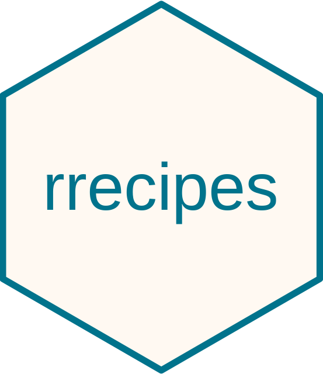

A hobby-project package containing functions to scrape recipes off the web. 

<!--more-->

<div align="center">

. 

</div>

## Premise 

As an avid amateur baker, I often search the web for the best recipes. Often times, I want to compare multiple recipes and paste them into an easier-to-access format such as a personal recipe list or send them to a friend. In a lot of cases, this involves a substantial amount of scrolling to the bottom of the page in order to find the recipe. 

Furthermore, another issue I encountered is that if I wish to paste the recipe to my own list, the format used by the site results in a lot of post-paste reformatting. I thought this would be the perfect time to create an R package that not only allows you to search popular recipe sites straight from R, but also allows you to extract the recipe without even having to visit the site. 

This project, while also useful for when I want to search for recipes, is also a way for me to practice using additional R packages and functions in addition to practice making a package. 

## The Package 

I present [rrecipes](https://github.com/colebaril/rrecipes), hosted on my [Github](https://github.com/colebaril) page. 

## rrecipes

This package contains some simple functions to scrape recipes from the web using the [`rvest`](https://rvest.tidyverse.org/) package. I got this idea as I was scrolling through paragraphs of mostly useless text on recipe websites trying to find the actual recipe. I also became frustrated when trying to copy and paste recipes to other applications and the website was less than ideal for doing so. This package is useful if you wish to extract multiple recipes from the web at once. It can also be used to convert recipe text on a website into a easily usable format (e.g., if you wish to copy and paste into another document or recipe book, as I am doing). 

Adding more sites and functionality in my spare time, as this is a hobby project.

## Download

To download and load the package, run the following code in R: 

```{R, rrecipes download}
devtools::install_git("https://github.com/colebaril/rrecipes")
library(rrecipes)
```

## Dependencies

There are a number of packages required to run this package, which are automatically attached with `rrecipes`.

1. dplyr
2. Magrittr
3. rvest
4. Stringr
5. data.table

## Functions


### `scrape()`

Use the `scrape()` function employs a variety of other functions to extract recipes from the web. Internet connection required. This function prints recipes to the console and saves a file called `scraped_recipes.txt` in your working directory. 

The `recipe_urls =`  argument takes in 1 or more recipe URLs. Make sure the URL is for a single recipe, not a list.

For example:

```{R}
scrape(recipe_urls = c(
  "https://www.allrecipes.com/recipe/25080/mmmmm-brownies/?internalSource=hub%20recipe&referringContentType=Search",
  "https://www.foodnetwork.ca/recipe/the-pioneer-woman-bbq-pork-walking-tacos-are-the-ultimate-snack/",
  "https://tasty.co/recipe/slow-cooker-ribs")) 
```
### Search Recipe Websites 

For each supported website, a search feature has been or is being implemented. Note that the search functions retrieve only the top 10 recipes. This means that as recipes move up and down in rank, or a new recipe is added to the site and is popular, the results will change.

#### `search_allrecipes()`

The `search_allrecipes()` function works by taking in an argument `query =`, which can be any word, and will return the top 10 URLs for your query. 

For example, running this:

```{R}
search_allrecipes(query = "brownies")
```
Yields this:
```
[1] "https://www.allrecipes.com/recipe/25080/mmmmm-brownies/"            "https://www.allrecipes.com/recipe/68436/vegan-brownies/"           
 [3] "https://www.allrecipes.com/recipe/10549/best-brownies/"             "https://www.allrecipes.com/recipe/10177/blonde-brownies-i/"        
 [5] "https://www.allrecipes.com/recipe/25817/white-brownies/"            "https://www.allrecipes.com/recipe/69886/best-brownies-ever/"       
 [7] "https://www.allrecipes.com/recipe/16607/cheesecake-brownies/"       "https://www.allrecipes.com/recipe/9698/walnut-brownies/"           
 [9] "https://www.allrecipes.com/recipe/277538/no-bake-healthy-brownies/" "https://www.allrecipes.com/recipe/274800/coffee-brownies/"         
 ```

The functions work with `dplyr`. For example, see below as we search for brownie recipes and scrape the code. In this example, The outputs are printed in the console and the brownie URLs are piped through the `scrape()` function which retrieves the complete recipes from the site and saves the recipes in a file called `scraped_recipes.txt` in your file directory. 
 


```
brownies <- search_allrecipes(query = "brownies") %>% 
  scrape()
```


Currently, single-word searches are only allowed (e.g., "pie" or "apple", but not "apple pie"). Adding a "+" character to the string (for the search URL to work) causes a whole bunch of issues which I am trying to solve to allow more specific searches.


## Supported Sites

1. allrecipes.com
2. foodnetwork.ca (Canadian version)
3. tasty.co

> More sites will be added as I feel like it, for this is a hobby project.

## In Development 

Support for more sites for both the `scrape()` and search functions are being implemented. Work is being done to group all search functions into one search function, although I am working out the kinks on this. 

## References 

Wickham H, François R, Henry L, Müller K (2022). _dplyr: A Grammar of Data Manipulation_. R package version 1.0.10,
<https://CRAN.R-project.org/package=dplyr>.

Wickham H (2022). _rvest: Easily Harvest (Scrape) Web Pages_. R package version 1.0.3, <https://CRAN.R-project.org/package=rvest>.

Wickham H, Girlich M (2022). _tidyr: Tidy Messy Data_. R package version 1.2.1, <https://CRAN.R-project.org/package=tidyr>.

Bache S, Wickham H (2022). _magrittr: A Forward-Pipe Operator for R_. R package version 2.0.3,
<https://CRAN.R-project.org/package=magrittr>.

Dowle M, Srinivasan A (2021). _data.table: Extension of `data.frame`_. R package version 1.14.2,
<https://CRAN.R-project.org/package=data.table>.

Yu G (2020). _hexSticker: Create Hexagon Sticker in R_. R package version 0.4.9, <https://CRAN.R-project.org/package=hexSticker>.

Qiu Y, details. aotifSfAf (2022). _sysfonts: Loading Fonts into R_. R package version 0.8.8, <https://CRAN.R-project.org/package=sysfonts>.

Ooms J (2021). _magick: Advanced Graphics and Image-Processing in R_. R package version 2.7.3, <https://CRAN.R-project.org/package=magick>.

References code:

```{R}
library(purrr)
c("dplyr", "rvest", "tidyr", "magrittr", "data.table", "hexSticker", "sysfonts", "magick") %>%
  map(citation) %>%
  print(style = "text")
```