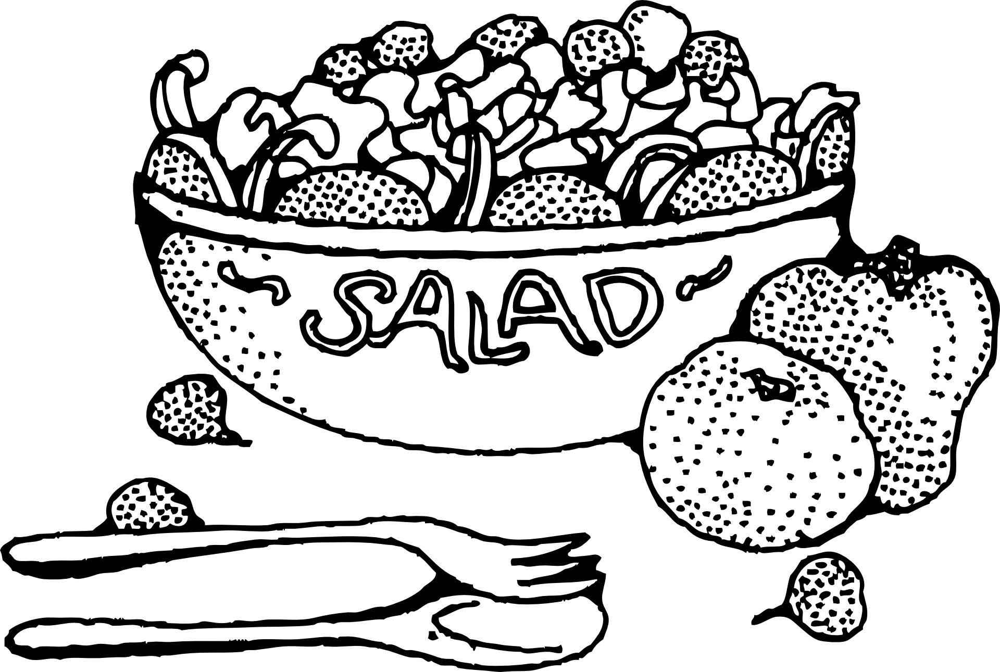

A collection of salad and dressing recipes from my cookbook. 

<!--more-->

## Greek Pasta Salad 

*Vanessa Baril*  

**Ingredients**

Dressing:

-   1/3 cup olive oil
-   1/2 cup vinegar
-   2 tsp sugar
-   1/4 tsp oregano
-   1/2 tsp thyme
-   1/2 tsp basil
-   1/2 tsp dry mustard
-   Pepper to taste

Salad:

-   1 box tri-colored pasta (fusilli)
-   Seeded and chopped cucumber
-   Chopped tomato
-   Chopped red/purple onion
-   Crumbled feta cheese

**Methods**

1.  Mix dressing ingredients together.
2.  Assemble salad
3.  Add dressing to salad.

> This recipe travels and stores well.

 

## Pickle Pasta Salad

**Ingredients**

-   3 cups dry shell pasta
-   1/3 cup pickles
-   2/3 cup cubed cheese
-   3 tbsp onion
-   2 tbsp dill
-   1/2 cup pickle juice

Dressing:

-   2/3 cup mayo
-   1/3 cup sour cream
-   1/8 tsp cayenne pepper
-   4 tbsp pickle juice
-   Salt
-   Pepper

**Methods**

Prepare salad and dressing; combine and toss when ready to serve.

 

## Mandarin Salad

**Ingredients**

-   1 head romaine lettuce
-   3 tins orange mandarin
-   1 bag of craisens
-   Poppy seed dressing (Kraft)

**Methods**

Combine all ingredients.

## Bean Salad

**Ingredients**

-   1 can cut green beans
-   1 can cut yellow beans
-   1 can kidney beans (drained)
-   1/2 to 3/4 can chick peas
-   Purple onion

Marinade (dressing):

-   1/4 tsp garlic salt
-   1/4 tsp pepper
-   1/2 tsp salt
-   6 tbsp white sugar
-   1/2 cup vinegar
-   1/2 cup salad oil
-   1/4 tsp dry mustard
-   1/2 tsp paprika

**Methods**

1.  Combine beans and onion.
2.  Mix marinade ingredients.
3.  Pour marinade over beans and onion mixture and mix well.
4.  Marinade for 6 hours and keep in the fridge.

 

## Pineapple Cole Slaw

*Emmy Penner*  

**Ingredients**

- 3/4 cup mayonnaise 
- 2 tablespoons sugar
- 2 teaspoons vinegar
- 1/2 teaspoon salt
- 1-2 tablespoons milk
- 8 cups cabbage, shredded
- 3/4 cup pineapple, crushed, or tidbits drained
- 1½ cups marshmallows, miniature, optional

**Methods**

1. In a large bowl mix cabbage, pineapple, and marshmallows.
2. In a small bowl mix sugar, salt, mayonnaise, vinegar, and milk.
3. Add to cabbage mixture and stir well.

## Red Cabbage Coleslaw

*Elva Madison*  

**Ingredients**

- 3 cups cabbage
- 1/2 cup green pepper
- 1/3 cup onion, chopped
- 1/2 cup celery, chopped
- 2 tablespoons sour cream 
- 2 tablespoons mayonnaise 
- 1/4 teaspoon black pepper
- 1/2 teaspoon garlic powder, obtional
- 1 teaspoon lemon juice

**Methods**

1. Mix shredded cabbage, green pepper, onion, and celery.
2. Mix sour cream, , black pepper, garlic powder, 
fresh lemon juice and salt. 
3. Mix well and let stand for a while for flavours to blend.

 

## Coleslaw Dressing

*Emmy Penner*  

**Ingredients**

-   1/4 cup sugar
-   1/4 cup half and half
-   1/4 cup salad dressing
-   1/4 cup vinegar
-   1/4 cup oil
-   Salt
-   Pepper
-   1/2 tsp celery seed

**Methods**

Combine all ingredients and mix well.

 

## Orzo Salad

*Deb Friesen*

**Ingredients**

- 1 cup orzo pasta
- 1 can (14 oz.) pineapple, crushed, / tidbits
- 1 can mandarin oranges
- 250 milliliters cool whip
- 1/3 cup sugar
- 1½ teaspoons flour
- 1/4 teaspoon salt
- 1 egg, beaten

**Methods**

1. Boil pasta for about 16-18 min. Rinse well, set aside.
2. Drain juice from fruits and add; sugar, flour, salt and egg.
Cook and thicken- pour over orzo pasta and refrigerate till sauce
is socked into orzo pasta. Optionally, add raisins or craisins. 
3. Once cooled and one hour before serving fold in cool whip and 
fruit.

## Potato Salad

*Emmy Penner*  

**Ingredients**

- 6 eggs
- 4½ cups potatoes
- 1/2 cup salad dressing
- 1/2 cup sour cream 
- 1/2 teaspoon mustard
- Salt and pepper to taste
- Milk, to thin

**Methods**

1. Boil potatoes with peel, boil eggs set aside to cool, nice if
 done the day before.
2. Peel potatoes and eggs, put eggs through egg slicer
both ways. Cut potatoes into small cubes.
3. Mix salad dressing , sour cream, mustard, salt and pepper.
Add milk to thin. Mix together with potatoes and eggs.

> It is best to mix a few hours prior to serving. Optionally, add more dressing if desired.
