This past weekend on August 7th, 2022 I had the pleasure of being invited to my Great Aunt Darlene and Great Uncle Gerry's cottage in the quaint town of Keewatin, just minutes outside of Kenora and exactly two hours East of Winnipeg. 

<!--more-->

## Welcome to Ontatio!

This past weekend on August 7th I had the pleasure of being invited to my Great Aunt Darlene and Great Uncle Gerry's cottage in the quaint town of Keewatin, just minutes outside of Kenora and exactly two hours East of Winnipeg. 

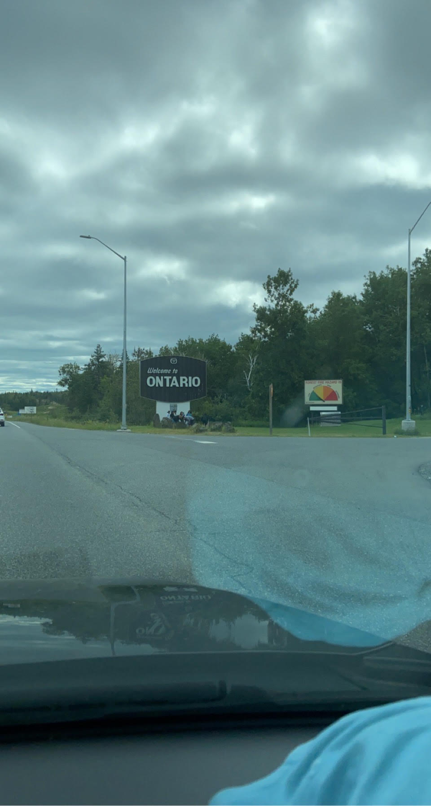

Darlene and Gerry have a large cottage filled to the brim with interesting odds and ends. Most, if not everything in the cottage has some sort of story attached to it. 

## The Crew 

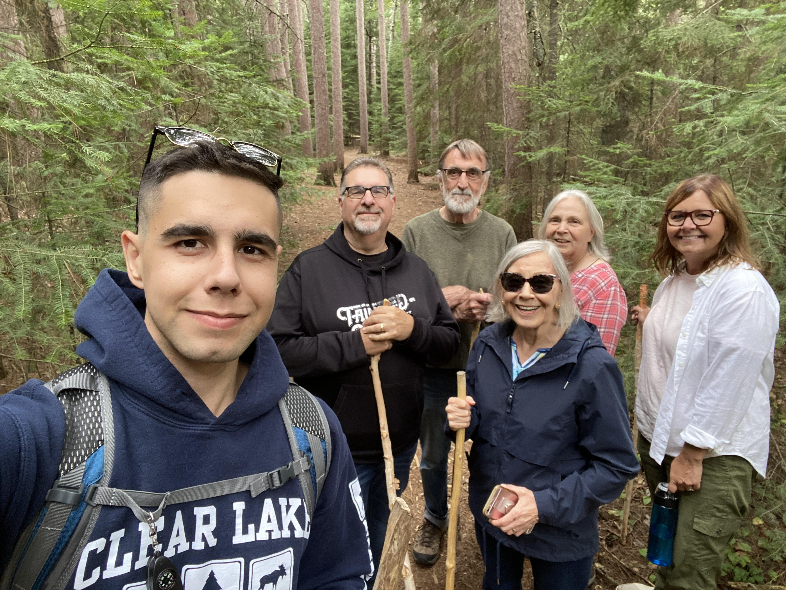

## Flora

### Balsam Fir

Along the Vernon Hiking Trail system, we came across a variety of "ecosytems" as Gerry called them, all within a short distance of one another. They include a section containing balsam fir trees, known as [*Abies balsamea*](https://en.wikipedia.org/wiki/Abies_balsamea). Balsam fir trees are spread out from as far East as Newfoundland to as far West as Alberta, but extend into the Interlake region of Manitoba and are not present in Soutuern Manitoba. 

This tree is out of bounds of where I live in Winnipeg, so this was a relatively new find for me. We learned that the Balsam trees are covered in "blisters", which contain balsam sap, the same ingredient used for a variety of things from candle making to food. The blisters can be popped, releasing a small, short lasting stream of sap. Releasing the sap is quite satisfying. The group compared it to popping bubble wrap or squeazing a zit. My mother took to the task of popping the balsam tree blisters and got a little carried away. 

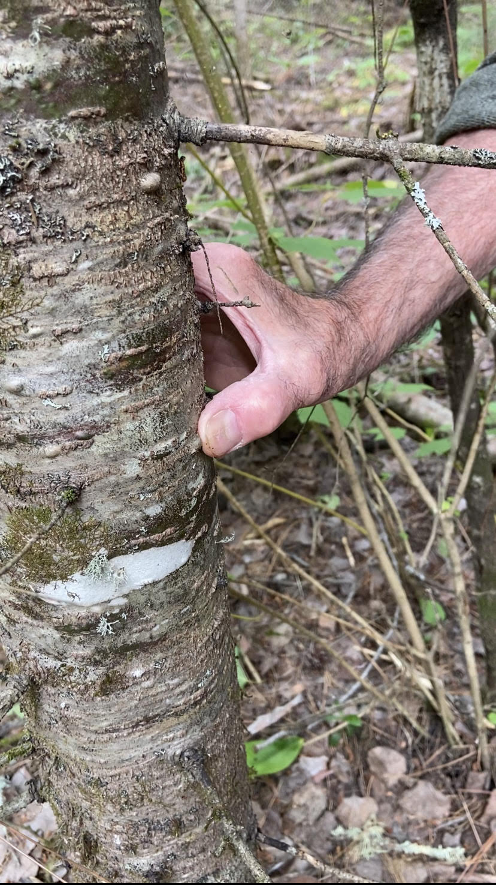

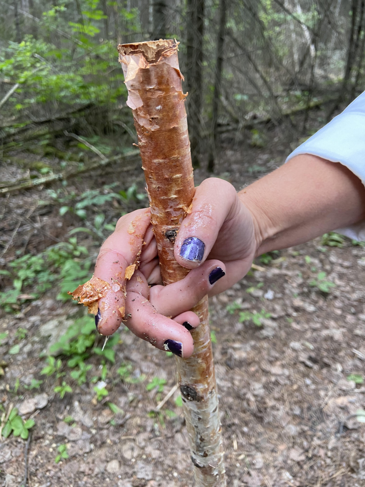

### Towering Poplar

The trail system contained another ecosystem rich with "Towering Poplars", also known as the trembling poplar, quaking aspen, American aspen, or, scientifically, [*Populus tremuloides*](https://en.wikipedia.org/wiki/Populus_tremuloides). Towering poplars are found all throughout North America, but is a defining feature of the Prairie Provinces in Canada. Towering poplars feature a very long trunk, pale bark with branches and leaves very high up in the canopy. This leaves them susceptible to breaking in high winds and storms, which we observed extensively along the trail. 

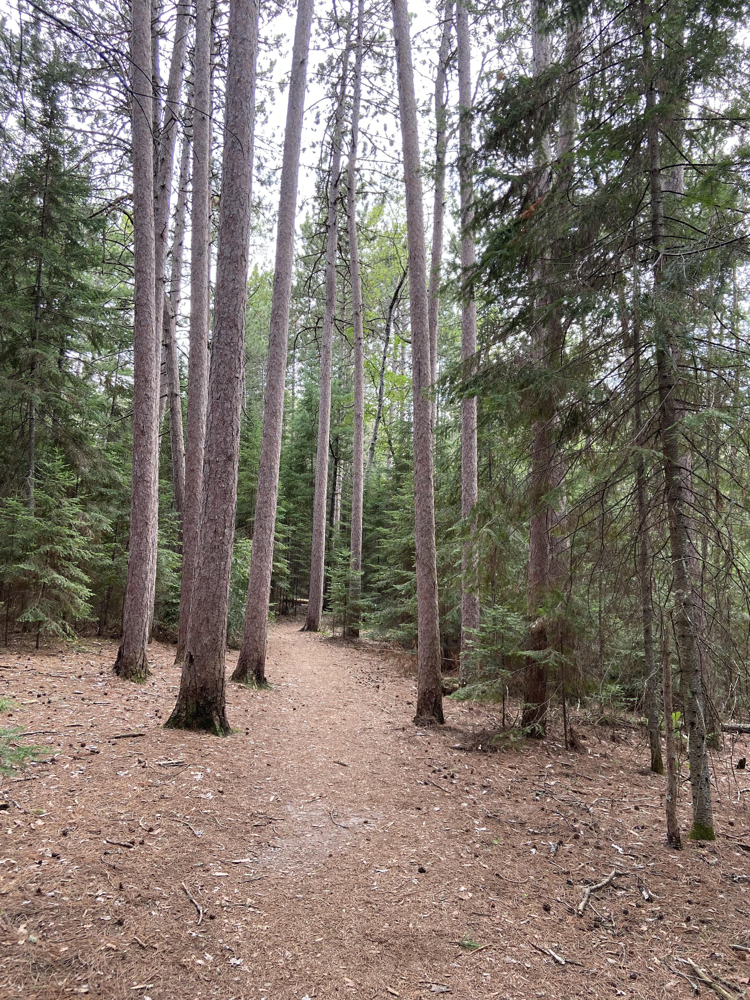

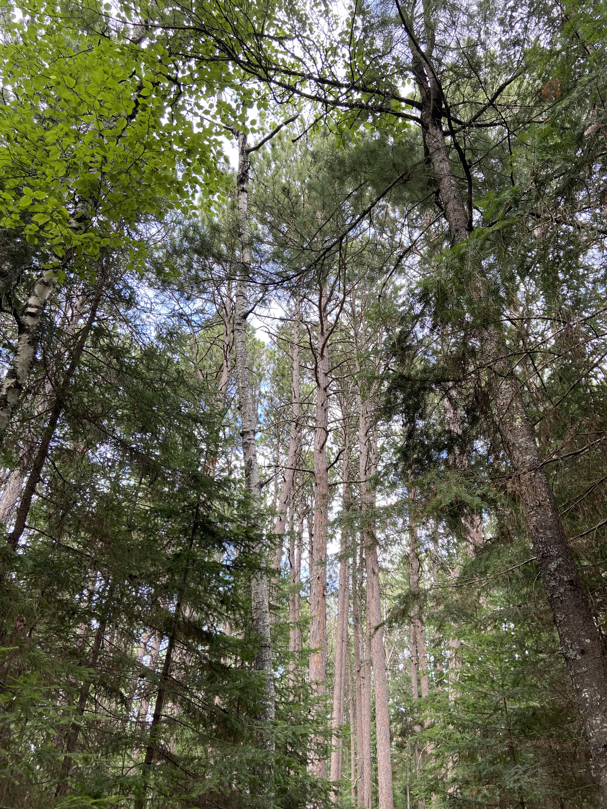

### Mushrooms 

We spotted a number of different mushrooms throughout the Vernon 

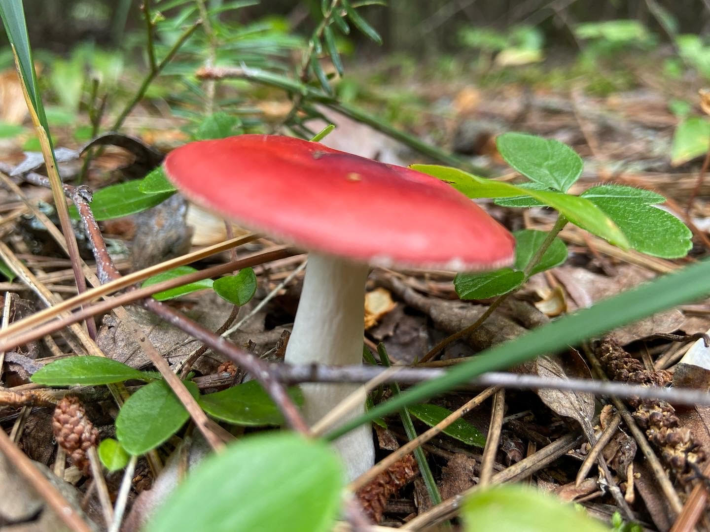

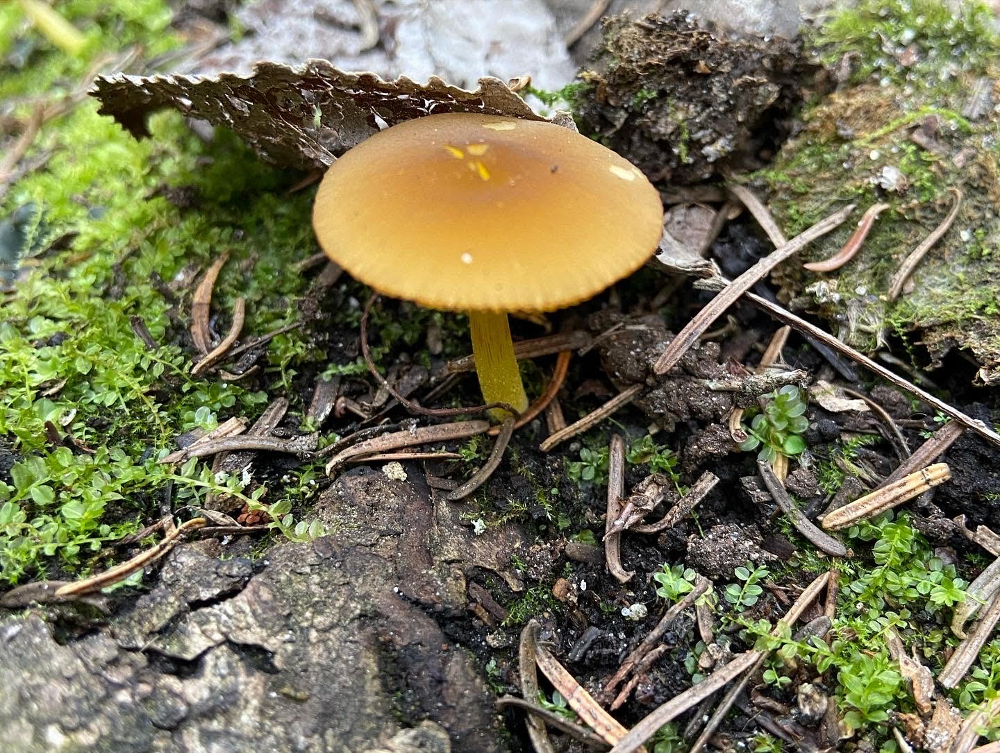

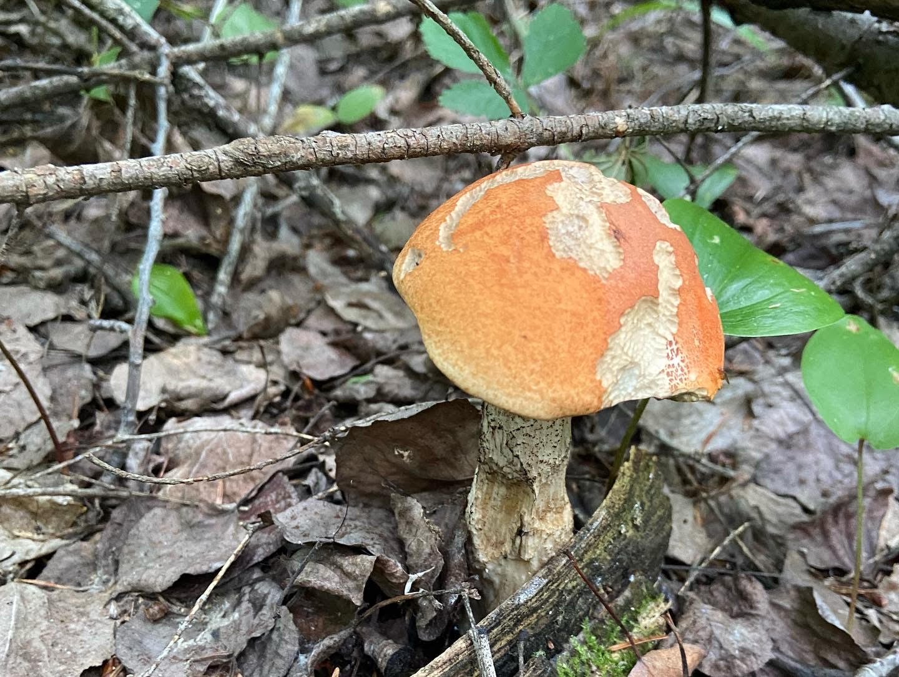

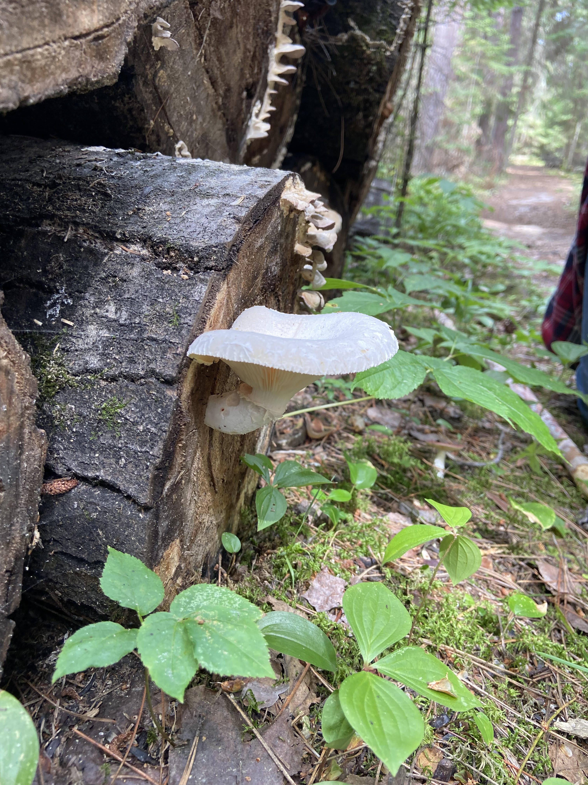

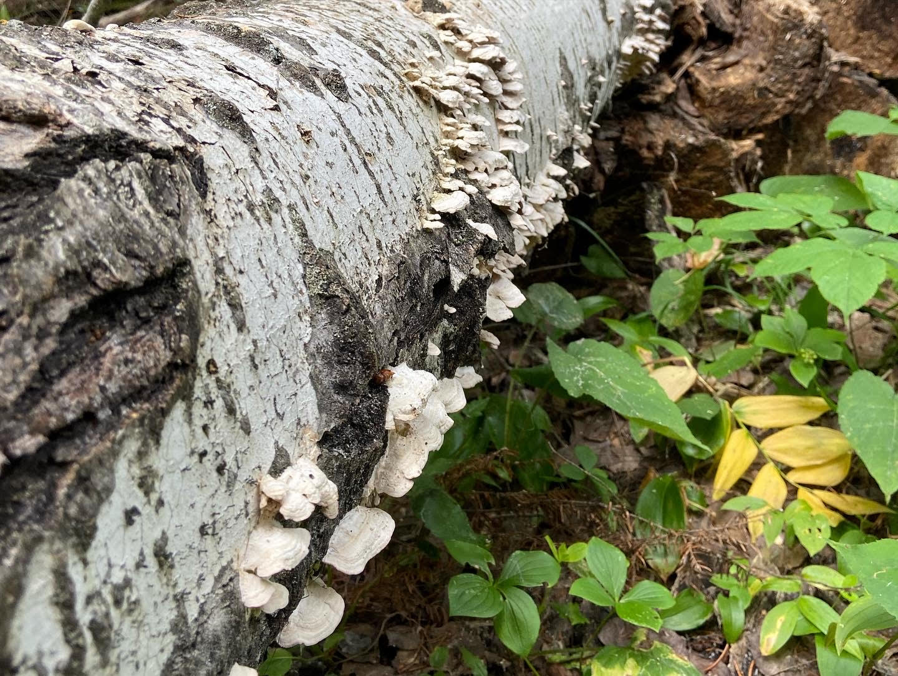

## Fauna 

We learned that deer are quite a common sight within the town site of both Keewatin and Kenora. We saw plenty of deer that let us come right up to them. I had seen tame deer before, but none this tame before. 
