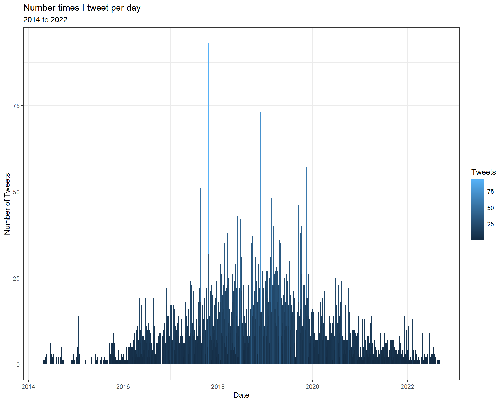
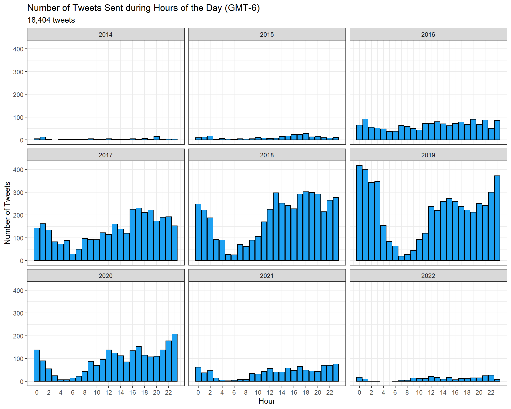
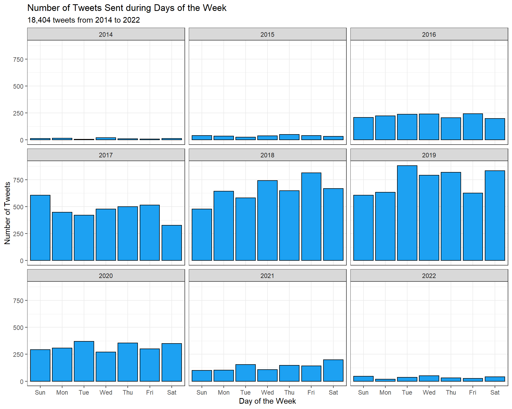

An analytical pipeline I developed for analyzing personal Twitter data.

<!--more-->

<style>
.block{
display:block;
}
</style>

## Premise 

This has evolved into a data science project for when I am bored. This will mostly serve as a place for me to practice 
using various R packages, functions and is a pretty cool project because I have 8 years of Twitter data. I used R and RStudio (now Posit) for
this analysis and feature mostly packages within the `tidyverse`. 

## Load Packages 

```
libs <- c(
  "tidyverse", "jsonlite", "stringr", "data.table",
  "gt", "patchwork", "hms", "tidytext", "lubridate",
  "treemapify"
)


# install missing libraries
installed_libs <- libs %in% rownames(installed.packages())
if (any(installed_libs == F)) {
  install.packages(libs[!installed_libs])
}

# load libraries
invisible(lapply(libs, library, character.only = T))
```

## Exporting your Twitter Data

To export your data from Twitter, you will need to request your Twitter data
from Twitter itself. To do so, login to your Twitter account on Desktop. On the left 
click More, then Settings then Your account. You should see a section called 
"Download an archive of your data". Click this and follow the instructions. 

For security reasons, it will take up to 24 hours to get your data back. When you
receive it, download and unpack the Zip folder. The folder will contain three files/folders:

1. assets folder
2. **data folder - this is what we want!**
3. "Your archive" - a HTML file containing your entire Twitter history. This file is good for searching for specific tweets if you need to find context.

Open the data folder and locate the JavaScript file called "tweet.js" (likely the largest file in the folder). 
For now, open this file in a simple text editor. Currently, the file is a JavaScript file, however, we want it 
to be a JSON (.json; JavaScript Object Notation) file so that we can read it into R. To convert it to a JSON file, simply strip the top line 
of code from the file: `window.YTD.tweet.part0 = [`. Once you do this, the file is now in JSON format you can read the file into R! 

## Reading your Twitter Data into R

To read your Twitter data into R, we are going to be using the `jsonlite` package using the `flatten = TRUE` parameter to 
automatically clean up the nesting and children in the file. 

```
twitterraw <- fromJSON("tweet.json", flatten = TRUE)
```

Next, I create a data frame I will be working with and removing columns that are unnecessary for the analysis
using `dplyr`. This is optional, but I prefer to not look at irrelevant columns throughout the analysis.

```
twitter <- twitterraw %>% 
  select(-1, -18, -19, -20, -21, -22, -23, -24)
```

Now we have a good looking data frame that we can work with for the analysis!

## Data Cleaning & Date/Time

### Key Data

There are some key parameters we will be analyzing later on. These include variables
such as the number of favorites on each tweet (`tweet.favorite_count`), the number of retweets
on each tweet (`tweet.retweet_count`) and whether a tweet was a status that you were the OP (original poster) for 
or if your tweet was in reply to someone else's tweet. To look at these variables I am creating a new 
column for each and coercing the favorite and retweet counts as numeric. Furthermore, we also assign a yes or no
label for if a tweet was a status (yes) or reply (no). We do this by using `case_when()` to evaluate whether
the `tweet.in_reply_to_status_id` is NA or not. If NA, the tweet was a status as there is no one being replied to. 

```
twitter <- twitter %>% 
  mutate(favorite_count = as.numeric(tweet.favorite_count)) %>% 
  mutate(retweet_count = as.numeric(tweet.retweet_count)) %>% 
  mutate(statusreply = case_when(is.na(tweet.in_reply_to_status_id) ~ "Yes",
                                 TRUE ~ "No"))
```

### Datetime

Twitter provides datetime data in UTC in a strange format that includes the three-letter
weekday abbreviation. I want to work with date in a specific format so we will deconstruct
the date using `separate()` and `unite()`. 

```
date_cut <- gsub(" \\+0000", "", twitter$tweet.created_at) %>% 
  as.data.table() %>% 
  rename(date = ".") %>% 
  separate("date", paste("datetime", 1:7, sep = " ")) %>% 
  rename("weekday" = "datetime 1",
         "month" = "datetime 2",
         "day" = "datetime 3",
         "hour" = "datetime 4",
         "minute" = "datetime 5",
         "second" = "datetime 6",
         "year" = "datetime 7")
 ``` 
 
Next, I created a formula to apply month numbers to month abbreviations and reformat the month as a number.


Reconfiguring dates in a different data frame for easier use/viewing. 

 
```
mo2Num <- function(x) match(tolower(x), tolower(month.abb))

monthnum <- mo2Num(date_cut$month)

date_cut$monthnum <- monthnum
```

Next, I reformat the date and coerce it as POSIXct format.

```
date <- date_cut %>% 
  unite(date, c(year, monthnum, day), sep = "-") %>% 
  unite(time, c(hour, minute, second), sep = ":") %>% 
  unite(datetime, c(date, time), sep = " ")

POSIXct <- as.POSIXct(date$datetime,
                      tz = "GMT", # Twitter gives time zones in UTC by default. 
                      "%Y-%m-%d %H:%M:%OS") 
POSIXct <- with_tz(POSIXct, tzone = "Etc/GMT+6") # Convert to GMT+6 timezone. 

date$POSIXct <- POSIXct
```

Here I bind the reformatted date to the main data frame and extract year and month variables. 

```
twitter <- cbind(twitter, date) %>%
  mutate(datetimed = ymd_hms(POSIXct)) %>% 
  mutate(year = year(ymd_hms(datetimed))) %>% 
  mutate(month = month(ymd_hms(datetimed)))
```

### Counting Tweets

We need a way to count each tweet so that we can use mathematical operators. To do this, 
I simply assign a 1 to each tweet in its own column `tweet.counter.1`. 

```
twitter[ , "tweet.counter.1"] <- +1
```

## Number of Tweets and Favourites

The total number of tweets should be evident by the number of rows in the data, but let's count to double check:
```
sum(twitter$tweet.counter.1)
## [1] 18404
```

This data set contains 18,404 tweets.

The total number of tweets and average number of favourites per tweet can be obtained:

```
sum(twitter$favorite_count)
## [1] 29538
mean(twitter$favorite_count)
## [1] 1.604977
```

There are 29,538 favorites with an average of 1.6 favorites per tweet.

## Tweet Histogram

The first step when looking at any data set is to create a histogram to identify
the shape of the data and how many types of events occurred. 

```
twitter %>% 
  mutate(day = floor_date(datetimed, "day")) %>%
  group_by(day) %>% 
  summarize(sum.day = sum(tweet.counter.1)) %>% 
  mutate(year = year(ymd(day))) %>% 
  mutate(month = month(ymd(day))) %>% 
  ggplot(aes(x = sum.day)) +
  theme_bw() +
  geom_histogram(fill = "#1DA1F2", colour = "black") +
  labs(title = "Tweet Histogram",
       x = "Number of Tweets",
       y = "Number of Days")
```

<div class="block">

</div>

> Here we can see that on the vast majority of days spent tweeting, only a few tweets were sent.

## Tweets per Day

Twitter does not give you data for days on which you do not tweet. Therefore, to 
calculate the average number of tweets per day, first calculate the number of days 
between the first and last tweet in the data set which you can retrieve by visually 
inspecting the data. You can also calculate other statistics including the highest number
of tweets sent in a single day.

```
difftime(as.POSIXct("2022-10-9", tz="UTC"), as.POSIXct("2014-4-25", tz="UTC"),  units = "days")
## Time difference of 3089 days

18404/3089 # Tweets per day including zero tweet days.
## [1] 5.957915

summary(tweetsperday$sum.day)
##    Min. 1st Qu.  Median    Mean 3rd Qu.    Max. 
##   1.000   2.000   6.000   8.005  11.000  93.000
```

Therefore, inclusive of days where *no* tweets were sent, there was an average of 
5.9 tweets sent per day over 3,089 days. Note that the `summary()` function is only
counting the available data, and the mean is representative of only days where at least
one day was sent. However, the highest number of tweets in a single day was 93. 

Let's visualize this over time:

```
twitter %>% 
  mutate(day = lubridate::floor_date(datetimed, "day")) %>%
  group_by(day) %>% 
  summarize(sum.day = sum(tweet.counter.1)) %>% 
  ggplot(aes(x = day, y = sum.day)) +
  geom_col(aes(colour = sum.day)) +
  labs(title = "Number times I tweet per day",
       subtitle = "2014 to 2022",
       x = "Date",
       y = "Number of Tweets", 
       colour = "Tweets"
       ) +
  theme_bw()
```


<div class="block">

</div>

> Here we can see that my tweeting activity seems to have peaked from 2017-2020.

## Tweeting Hours

We can visualize tweets sent by time of day too. We are using the `floor_date` 
function to determine the number of tweets sent in each hour of the day. 

```
twitter %>% 
  mutate(hour_floor = floor_date(datetimed, "hour")) %>%
  mutate(hour = as_hms(hour_floor)) %>% 
  group_by(year, hour) %>% 
  summarize(sum.hour = sum(tweet.counter.1)) %>% 
  mutate(hour = hour(hour)) %>% 
  ggplot(aes(x = hour, y = sum.hour)) + 
    theme_bw() +
    geom_bar(stat = "identity", position = "dodge", fill = "#1DA1F2", colour = "black") +
    scale_x_continuous(breaks = seq(0, 23, 2)) +
    labs(title = "Number of Tweets Sent during Hours of the Day (GMT-6)",
        subtitle = "18,404 tweets",
        x = "Hour",
        y = "Number of Tweets") +
    facet_wrap(~year)
```
<div class="block">

</div>

> It looks like I Tweet the least during the night, which makes sense. 

## Days of the week

I was also curious if I tweeted more on different days of the week. 

```
twitter %>% 
  group_by(year, weekday) %>% 
  summarize(tweet.counter.1 = sum(tweet.counter.1)) %>% 
  ggplot(aes(
  x = factor(weekday, level = c('Sun', 'Mon', 'Tue', 'Wed', 'Thu', 'Fri', 'Sat')), 
  y = tweet.counter.1)) + 
  geom_col(fill = "#1DA1F2", colour = "black") +
  labs(title = "Number of Tweets Sent during Days of the Week",
       subtitle = "18,404 tweets from 2014 to 2022",
       x = "Day of the Week",
       y = "Number of Tweets") +
  theme_bw() +
  facet_wrap(~year) +
  theme(legend.position = "none")
```

<div class="block">

</div>

> Little difference between days of the week, though slightly less on Sunday and Monday. 

## Favourites & Retweets

In total there were 29,538 favorites on all 18,404 tweets with an average of 1.6 favorites per tweet, as determined before. 

```
sum(twitter$favorite_count)
## [1] 29538
mean(twitter$favorite_count)
## [1] 1.604977
length(which(twitter$favorite_count==0))
## [1] 10903
length(which(twitter$favorite_count==1))
## [1] 4073
length(which(twitter$favorite_count==2))
## [1] 1212
```

> There are 10,903 tweets with 0 favorites, 4,073 with 1 favorite and 1,212 with 2 favourites. Most have very few favorites.

Let's visualize and color tweets by whether it was a status or reply

```
ggplot(data = twitter, aes(x = datetimed, y = favorite_count)) + 
  geom_point(aes(size = retweet_count, color = statusreply))  +
  scale_y_continuous(trans = "log1p", breaks = c(0, 1, 2, 3, 4, 5, 10, 50, 100, 500, 1000, 1500)) +
  scale_colour_manual(
    labels = c("Reply", "Status"),
    values = c("#1DA1F2", "black")) +
  labs(title = "Tweet Interactions: Status vs. Reply",
       subtitle = "Number of favourites (log scale) for 18,404 tweets differentiated by status (black) and replies (blue) with the number of retweets reflected by point size. Each point represents one tweet.",
       x = "Date",
       y = "Number of Favourites (Log Scale)",
       size = "Retweets",
       color = "") +
  theme_bw() +
  guides(color = guide_legend(override.aes = list(size = 5)))
  ```
<div class="block">

</div>

> It looks like in general, statuses have more favourites than replies. 

## Tweet Device 

We can determine how many tweets were sent from which device fairly easily. The `tweet.source` column 
displays the source of the tweet as an HTML attribute (`a href`). For example:

`<a href="http://twitter.com" rel="nofollow">Twitter Web Client</a>'`

It's fairly intuitive to determine what each attribute means. The above came from the Web Client.
However, it will take a bit of cleaning as the names of the source are less than ideal. We will 
change these up and plot. 

```
twitter %>% 
  group_by(tweet.source, year, month, weekday, statusreply) %>% 
  summarize(sum.device = sum(tweet.counter.1)) %>% 
  mutate(tweet.source = replace(tweet.source,
                                tweet.source == '<a href="http://twitter.com" rel="nofollow">Twitter Web Client</a>', "Web Client")) %>% 
  mutate(tweet.source = replace(tweet.source,
                                tweet.source == '<a href="http://twitter.com/download/android" rel="nofollow">Twitter for Android</a>', "Android")) %>% 
  mutate(tweet.source = replace(tweet.source,
                                tweet.source == '<a href="http://twitter.com/download/iphone" rel="nofollow">Twitter for iPhone</a>', "iPhone")) %>%
  mutate(tweet.source = replace(tweet.source,
                                tweet.source == '<a href="https://mobile.twitter.com" rel="nofollow">Twitter Web App</a>', "Mobile Web Client")) %>%
  mutate(tweet.source = replace(tweet.source,
                                tweet.source == '<a href="https://affinitweet.com/" rel="nofollow">Affinitweet.com</a>', "External App")) %>% 
  mutate(tweet.source = replace(tweet.source,
                                tweet.source == '<a href="http://erased13368325.com" rel="nofollow">erased13368325</a>', "External App")) %>% 
mutate(tweet.source = replace(tweet.source,
                              tweet.source == '<a href="http://roundyearfun.com/twitterfamily" rel="nofollow">Twitter Family Tree</a>', "External App")) %>% 
mutate(tweet.source = replace(tweet.source,
                              tweet.source ==   
'<a href="https://www.nintendo.com/countryselector" rel="nofollow">Nintendo Switch Share</a>', "Nintendo Switch")) %>% 
  filter(tweet.source != "Nintendo Switch") %>% 
  filter(tweet.source != "External App") %>% 
  group_by(statusreply, weekday, month, year, tweet.source) %>% 
  summarize(sum.device = sum(sum.device)) %>% 
  ggplot(aes(x = factor(tweet.source, level = c(
    'Android', 'iPhone', 'Mobile Web Client', 'Web Client', 'Nintendo Switch', 'External App')), 
    y = sum.device)) +
  geom_col(fill = "#1DA1F2") +
  labs(title = "Number of Tweets Sent from Each Device",
       subtitle = "18,404 tweets divided by whether each tweet was a reply or status and by the device used to Tweet. 1 tweet was sent by a Nintendo Switch, and 3 via an external app, which were removed. ",
       x = "Device",
       y = "Number of Tweets") +
  facet_wrap(~statusreply, labeller = as_labeller(c("Yes" = "Status", 
                                                    "No" = "Reply"))) +
  theme_bw() +
  facet_wrap(~year)
```

<div class="block">

</div>

## Length of Tweets

```
tweetlength <- as.data.frame(twitter$tweet.display_text_range) %>% 
  transpose() %>% 
  select(-1) %>% 
  rename("tweetlength" = "V2") %>% 
  unlist() %>% 
  as.integer()

twitter <- cbind(twitter, tweetlength) 

summary(twitter$tweetlength)
##    Min. 1st Qu.  Median    Mean 3rd Qu.    Max. 
##    2.00   45.00   79.00   96.14  132.00  543.00
```

> The lowest number of characters in a tweet was 2, while the highest was 543, while
> the mean number of characters per tweet is 96. 543 is far greater than the limit. This
> is likely due to @mentions and portions of link not counting toward character limits in
> the app, but is captured by the data.

```
twitter %>% 
  ggplot(aes(x = datetimed, y = tweetlength)) +
  geom_point(colour = "#1DA1F2") +
  geom_vline(xintercept = as.numeric(as.POSIXct("2017-11-07 16:01:00")), linetype = "dashed", colour = "red") +
  geom_hline(yintercept = 140, linetype = "dashed", colour = "red") +
  geom_hline(yintercept = 280, linetype = "dashed", colour = "red") +
  annotate("text", 
           x = as.POSIXct("2017-10-01 16:01:00"), 
           y = 400, 
           label = "Twitter Announces Character Limit Increase to 280", 
           angle = 90) +
  annotate("text", 
           x = as.POSIXct("2015-10-01 16:01:00"),
           y = 150,
           label = "140 Character Limit") +
  annotate("text", 
           x = as.POSIXct("2015-10-01 16:01:00"),
           y = 290,
           label = "280 Character Limit") +
  theme_bw() +
  labs(
    title = "Number of Characters in Each Tweet",
    subtitle = "18,404 tweets with their character limit mapped over time. Where characters exceed the limit, this is due to Twitter handles 
    and long links counting toward the overall character count, but not counting for the Tweet limit itself.",
    x = "Date",
    y = "Length of Tweet")
```

<div class="block">

</div>

> Shown in this figure is the number of characters in each tweet over time. As you can see, there is a sharp increase around the time
> when Twitter announced a character limit increase in [November of 2017](https://www.washingtonpost.com/news/the-switch/wp/2017/11/07/twitter-is-officially-doubling-the-character-limit-to-280/). 


In some cases, other usernames contained within the tweet and portions of links do not count for the limit on Twitter, but are counted in the total character count. 


## Word Sentiment Analysis 

> Using the `tidytext` package to analyze words and sentiments. 

### Cleaning


The function below serves as a way to clean tweets of any characters that are not real words I have annotated the function to explain what it does.


```
unclean_tweet <- twitter$tweet.full_text


clean_tweets <- function(x) {
  x %>%
    # Remove URLs
    str_remove_all(" ?(f|ht)(tp)(s?)(://)(.*)[.|/](.*)") %>%
    # Remove mentions e.g. "@my_account"
    str_remove_all("@[[:alnum:]_]{4,}") %>%
    # Remove hashtags
    str_remove_all("#[[:alnum:]_]+") %>%
    # Replace "&" character reference with "and"
    str_replace_all("&amp;", "and") %>%
    # Remove puntucation, using a standard character class
    str_remove_all("[[:punct:]]") %>%
    # Remove "RT: " from beginning of retweets
    str_remove_all("^RT:? ") %>%
    # Replace any newline characters with a space
    str_replace_all("\\\n", " ") %>%
    # Make everything lowercase
    str_to_lower() %>%
    # Remove any trailing whitespace around the text
    str_trim("both")
}

cleaned_tweets <- unclean_tweet %>% 
  clean_tweets() %>% 
  tibble(line = 1:18404) %>% 
  rename_at(1, ~'text')
```


### Extract Words

```
word_df <- cleaned_tweets %>% 
  unnest_tokens(word, text)
```

> After cleaning, there are a total of **258, 147 words**.

### Bing Lexicon

> The Bing lexicon classifies words as either positive or negative sentiments.


The Bing Lexicon works by classifying each word as either "positive" or "negative". For example, the following table
is a list of the most used positive words. Their score (n) represents the number of times they were used.

```
## # A tibble: 1,849 × 2
##    word       n
##    <chr>  <int>
##  1 like    1466
##  2 good     711
##  3 love     410
##  4 shit     300
##  5 well     286
##  6 work     268
##  7 right    267
##  8 bad      245
##  9 better   227
## 10 fun      196
## # … with 1,839 more rows
```


Here, we are making use of the `tidytext` package to get a set of sentiments and match them up the database of words (`word_df`) coming from my Twitter data.

```
word_df %>%  
  inner_join(get_sentiments("bing")) %>% 
  count(word, sentiment) %>% 
  pivot_wider(names_from = sentiment, values_from = n, values_fill = 0) %>% 
  mutate(sentiment = positive - negative) %>% 
  ggplot(aes(word, sentiment)) +
  geom_col(show.legend = FALSE) +
  theme(axis.text.x=element_blank(),
        axis.ticks.x=element_blank()) +
  labs(title = "Twitter Word Sentiment",
       subtitle = "The number of times each positive (e.g., > 0) ad negative (e.g., < 0) word was Tweeted.",
       y = "Sentiment Value",
       x = "Word")
```

> This figure below shows the number of times each positive and negative word was used. 
> Notice how there are few but bigger spikes in positive sentiment values, but more frequent but lower spikes in negative sentiment values. 
> I am going to extract some of the >most used positive and negative words to see if we can learn more.

<div class="block">

</div>

### NRC Lexicon

> The NRC Lexicon works by assigning words to a variety of basic, core human emotions:
> - Anger
> - Fear
> - Anticipation
> - Trust
> - Surprise
> - Sadness
> - Joy
> - Disgust
> - Positive
> - Negative

It works similar to the Bing Lexicon, however there are more emotions. I use the `treemapify` package
which employs `ggplot2` to make a treemap. 

```
nrc <- get_sentiments("nrc")

word_df %>% 
  inner_join(get_sentiments("nrc")) %>% 
  count(word, sentiment) %>% 
  pivot_wider(names_from = sentiment, values_from = n, values_fill = 0) %>% 
  select_if(is.numeric) %>% 
  map_dbl(sum) %>% 
  as.data.frame() %>% 
  rownames_to_column("Emotion") %>% 
  rename("number" = ".") %>% 
  mutate(across(where(is.character), tools::toTitleCase)) %>% 
  ggplot(aes(area = number, fill = Emotion, label = Emotion)) +
  geom_treemap() + 
  geom_treemap_text(colour = "Black", 
                    place = "centre",
                    size = 25) +
  scale_fill_viridis_d() +
  labs(title = "Emotions based on Tweeted words",
       subtitle = "NRC Lexicon")
```

<div class="block">

</div>

## References 


Wickham H, Averick M, Bryan J, Chang W, McGowan LD, François R, Grolemund G, Hayes A, Henry L, Hester J, Kuhn M, Pedersen TL, Miller E, Bache SM, Müller K,
Ooms J, Robinson D, Seidel DP, Spinu V, Takahashi K, Vaughan D, Wilke C, Woo K, Yutani H (2019). “Welcome to the tidyverse.” _Journal of Open Source Software_,
*4*(43), 1686. doi:10.21105/joss.01686 <https://doi.org/10.21105/joss.01686>.


Ooms J (2014). “The jsonlite Package: A Practical and Consistent Mapping Between JSON Data and R Objects.” _arXiv:1403.2805 [stat.CO]_.
<https://arxiv.org/abs/1403.2805>.


Wickham H (2022). _stringr: Simple, Consistent Wrappers for Common String Operations_. R package version 1.4.1, <https://CRAN.R-project.org/package=stringr>.


Dowle M, Srinivasan A (2021). _data.table: Extension of `data.frame`_. R package version 1.14.2, <https://CRAN.R-project.org/package=data.table>.


Pedersen T (2022). _patchwork: The Composer of Plots_. R package version 1.1.2, <https://CRAN.R-project.org/package=patchwork>.


Müller K (2022). _hms: Pretty Time of Day_. R package version 1.1.2, <https://CRAN.R-project.org/package=hms>.


Silge J, Robinson D (2016). “tidytext: Text Mining and Analysis Using Tidy Data Principles in R.” _JOSS_, *1*(3). doi:10.21105/joss.00037
<https://doi.org/10.21105/joss.00037>, <http://dx.doi.org/10.21105/joss.00037>.


Wilkins D (2021). _treemapify: Draw Treemaps in 'ggplot2'_. R package version 2.5.5, <https://CRAN.R-project.org/package=treemapify>.


Fellows I (2018). _wordcloud: Word Clouds_. R package version 2.6, <https://CRAN.R-project.org/package=wordcloud>.


Wickham H (2007). “Reshaping Data with the reshape Package.” _Journal of Statistical Software_, *21*(12), 1-20. <http://www.jstatsoft.org/v21/i12/>.

**References Code**

```
library(purrr)
c("tidyverse", "jsonlite", "stringr", "data.table", "patchwork", "hms", "tidytext", "treemapify", "wordcloud", "reshape2") %>%
  map(citation) %>%
  print(style = "text")
```