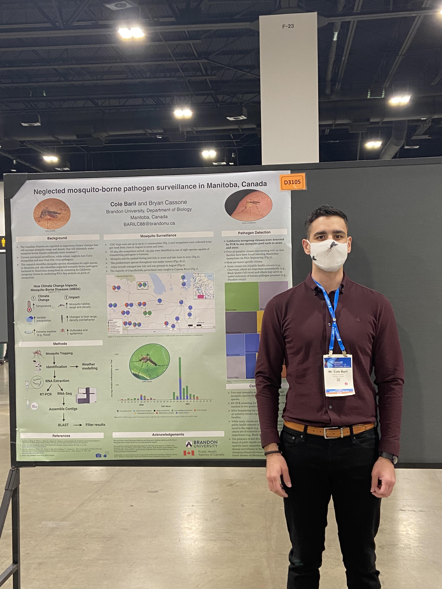

## 1 Publications 

1. (In Prep): Black queen cell virus detected in Canadian mosquitoes. Authors: **Cole Baril**, Christophe MR. LeMoine, Bryan J. Cassone. 

> Black queen cell virus (BQCV) is a ubiquitous honeybee viruses and significant pathogen to queen bee (Apis mellifera) larvae. In this study, we used next generation sequencing to identify 
> BQCV in Aedes vexans collected in 2019 and 2020 from Manitoba, Canada. We assembled de novo the near complete genome sequence of the virus, which is the first available from North America 
> and first report of BQCV being harbored by mosquitoes. Since we also identified sequences of plant origin in the mosquito samples, we hypothesize that the virus was indirectly acquired by 
> foraging at the same nectar sources as honey bees. 

## 2 Posters

### Neglected mosquito-borne pathogen surveillance in Manitoba, Canada

Presented a poster for the 2021 [Entomological Society of America](https://entsoc.org/) Conference.

Denver, Colorado

Authors: **Baril, C.W.** & Cassone, B.J.

## 3 Presentations

### Mosquito Surveillance and California Serogroup in Manitoba 

Presented a research presentation for the National Vector-borne Disease Sharing Table. 

August 10th, 2022. 

Author: Baril, C.W.

### Characterizing the Microbiome of Manitoban Mosquitoes

Presented a research presentation for the [North Central Mosquito Control Association](http://north-central-mosquito.org/WPSite/) 2022 Annual Meeting

Received a student award for presenting a high quality talk.

Author: Baril, C.W.

### Mosquito Surveillance for California Serogroup and Cache Valley Viruses in Manitoba

Research presentation for the Brandon University 2021 Science Seminar Series.

Author: Baril, C.W.

## 4 Press 

### Media Features for Mosquito Surveillance

* Shoal Lake June 2020 Newsletter
* What's Up Yellowhead June 2020 Newsletter 
* Cypress River community newsletters (2021)

